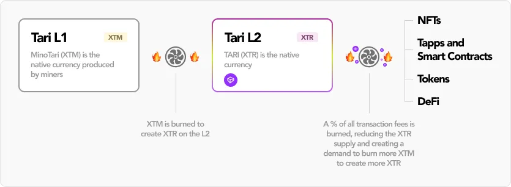
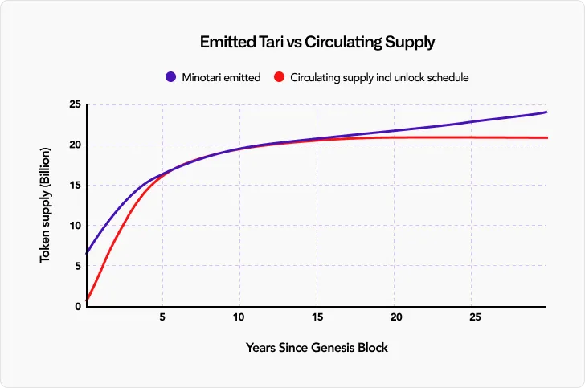
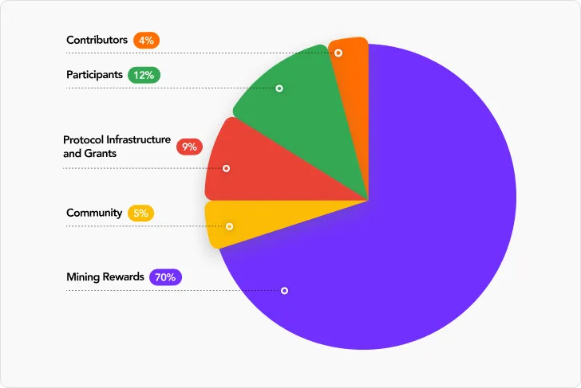
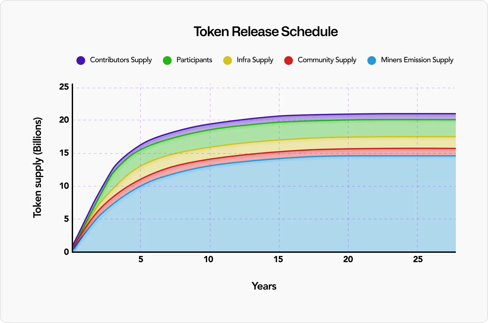

# RFC-0191/Tokenomics

**Maintainer(s)**: none

## Tari Tokenomics

<!-- TOC -->
* [RFC-0191/Tokenomics](#rfc-0191tokenomics)
* [License](#license)
  * [Language](#language)
  * [Disclaimer](#disclaimer)
  * [Goals](#goals)
  * [Related RFCs](#related-rfcs)
<!-- TOC -->

# License

[ The 3-Clause BSD License](https://opensource.org/licenses/BSD-3-Clause).

Copyright 2018 The Tari Development Community

Redistribution and use in source and binary forms, with or without modification, are permitted provided that the
following conditions are met:

1. Redistributions of this document must retain the above copyright notice, this list of conditions and the following
   disclaimer.
2. Redistributions in binary form must reproduce the above copyright notice, this list of conditions and the following
   disclaimer in the documentation and/or other materials provided with the distribution.
3. Neither the name of the copyright holder nor the names of its contributors may be used to endorse or promote products
   derived from this software without specific prior written permission.

THIS DOCUMENT IS PROVIDED BY THE COPYRIGHT HOLDERS AND CONTRIBUTORS "AS IS" AND ANY EXPRESS OR IMPLIED WARRANTIES,
INCLUDING, BUT NOT LIMITED TO, THE IMPLIED WARRANTIES OF MERCHANTABILITY AND FITNESS FOR A PARTICULAR PURPOSE ARE
DISCLAIMED. IN NO EVENT SHALL THE COPYRIGHT HOLDER OR CONTRIBUTORS BE LIABLE FOR ANY DIRECT, INDIRECT, INCIDENTAL,
SPECIAL, EXEMPLARY, OR CONSEQUENTIAL DAMAGES (INCLUDING, BUT NOT LIMITED TO, PROCUREMENT OF SUBSTITUTE GOODS OR
SERVICES; LOSS OF USE, DATA, OR PROFITS; OR BUSINESS INTERRUPTION) HOWEVER CAUSED AND ON ANY THEORY OF LIABILITY,
WHETHER IN CONTRACT, STRICT LIABILITY, OR TORT (INCLUDING NEGLIGENCE OR OTHERWISE) ARISING IN ANY WAY OUT OF THE USE OF
THIS SOFTWARE, EVEN IF ADVISED OF THE POSSIBILITY OF SUCH DAMAGE.

## Disclaimer

The purpose of this document and its content is for information purposes only and may be subject to change or update
without notice.

This document may include preliminary concepts that may or may not be in the process of being developed by the Tari
community. The release of this document is intended solely for review and discussion by the community regarding the
technological merits of the potential system outlined herein


## Goals

This is a copy of the blog post posted on [Substack](https://tari.substack.com/p/tari-tokenomics), reposted as-is here for comment. I did not author the original post, nor are any of these my opinions. I have not made any changes to the original.

## Related RFCs

## Description

```
NOTICE TO RESIDENTS OF THE UNITED STATES: TARI HAS NOT BEEN REGISTERED UNDER THE SECURITIES ACT OF 1933, AS AMENDED, AND MAY NOT BE OFFERED OR SOLD IN THE U.S. OR TO U.S. PERSONS (AS SUCH TERM IS DEFINED IN RULE 902 AS PROMULGATED BY THE U.S. SECURITIES AND EXCHANGE COMMISSION) UNLESS IT IS REGISTERED UNDER SUCH ACT, OR AN EXEMPTION FROM THE REGISTRATION REQUIREMENTS OF SUCH ACT IS AVAILABLE.
```

### “Wen Token?”

It is a rallying cry as poignant as it is timeless. Of course, the inquisitors can expect a blunt and enthusiastic "soon!" in response. But this isn't an article about "Wen;" it is an article about How. The time has come to reveal the details of Tari tokenomics. 

### The Big Picture:
Let's get down to brass tacks. The Tari network has two layers: layer 1 (aka the Minotari network) and layer 2 (aka the Ootle network). Layer 1 is secured by proof of work. Miners are rewarded with Minotari tokens (XTM). Layer 2 is a Byzantine fault-tolerant network fueled by the Tari token (XTR).

There will be 21 billion XTM as the initial supply, with a tail emission of 1% per year. 6.3 billion tokens, or 30% of the initial supply, will be pre-mined with significant lockups and vesting schedules. The pre-mined tokens will be used to support protocol infrastructure, offer community incentives and grants, and ensure a sufficient allocation of tokens for contributors and supporters. 100% of tokens emitted by the protocol after the pre-mine go to miners who secure the Tari network.

There is a deep relationship between XTM tokens and XTR tokens. The only way to create XTR is to burn XTM 1:1. A transaction fee-oriented burn mechanism on the Ootle network will help ensure overall token supply equilibrium. There is much to cover, so let’s start with the Tari Layer 1 proof of work model and XTM. 

### Proof of Work Distribution 
Once considered the gold standard for securing blockchains, proof of work originated with Satoshi Nakamoto’s implementation for Bitcoin. Recently, it’s fallen out of favor for proof of stake consensus mechanisms. We strongly believe that in the coming months, there will be a renewed appreciation for Nakamoto consensus: A blockchain consensus mechanism combining proof of work and the longest chain rule to achieve network agreement on the blockchain state. Anyone and everyone will be able to mine Minotari on Day 1 - creating a world where everyone has a voice and an opportunity to participate in the network and shape its future. This accessibility brings a fair distribution that’s been absent in recent projects. You don’t need to be an early investor or an airdrop farmer to get XTM; simply contributing raw hash power to the network is enough.

Tari miners receive XTM for every block they mine, with block rewards declining on a block-by-block basis. In the first 12 years post-mainnet launch, the Tari emission curve dictates the mining reward. After 12 years, the protocol rewards miners via a tail emission to ensure they receive compensation forever for securing the network. The tail emission increases the XTM emitted by 1% a year. Tari miners receive 100% of block rewards and Layer 1 transaction fees.


Unlike Bitcoin, which operates on a 4-year halving schedule, the Tari block rewards decrease steadily over time block-by-block through an exponential decay function, halving approximately every three years.

Network rewards are split 50/50, with half of the Tari block reward going towards Monero merge mining performed with the RandomX hashing algorithm and 50% of the block rewards going to Tari standalone miners using the SHA3x hashing algorithm. RandomX is a proof of work (PoW) algorithm designed to be ASIC-resistant by optimizing for general-purpose CPUs, ensuring fairer, more accessible, and more decentralized mining. The merge-mining aspect of Tari will enable existing Monero miners to increase their revenue and keep them successfully mining both Monero and Tari for the foreseeable future. The Tari protocol bakes this 50/50 distribution into the consensus rules.

### Burn Baby Burn: The Turbine Model
All dapp (tapp!) activity will occur on the Tari Layer 2 (aka the Ootle), including DeFi, NFTs, SocialFi, GameFi, stablecoins, streaming payments, and more. Tari contributors have designed an elegant relationship between the Layer 1 tokens (XTM) and the Layer 2 tokens (XTR) to offset supply inflation and maintain a soft peg between them. Tari contributors achieve the interplay between the two tokens through a token model called the Turbine Model.

In the Tari Turbine Model, the only way to create XTR tokens is to burn XTM tokens on the Layer 1 and redeem the XTR 1:1 on the Ootle network. As a result, there is a one-way relationship between the two tokens. On the Ootle, a portion of the transaction fee is paid to validators, and a portion of the transaction fee is burned. This token-burning mechanism creates a powerful economic model where Tari miners can confidently secure the network forever, and at scale, the overall Tari token economy achieves circulating supply equilibrium. 



The Turbine Model enables Tari to maintain a soft 1:1 peg between Minotari (XTM) and Tari (XTR) without using complicated peg-out mechanisms like drive chains or federated pegs. 



Other things being equal, greater activity on the Ootle depletes the supply of Tari tokens faster. Mining rewards on the Minotari network in the form of XTM replenishes the supply of XTR.

The Throttle actively controls the burn rate for XTR associated with every transaction on the Ootle. The Throttle is an algorithm run via consensus by validator nodes that periodically adjusts the burn rate to maintain the stability of the Tari ecosystem. The Throttle has three priorities in decreasing order of importance: to i) maintain the XTM:XTR peg, ii) maintain a stable supply of XTR + XTM, and iii) maintain a total token supply of 21 billion tokens.

Tari’s fast finality, sub-penny transaction fees, infinite scalability, programmable confidentiality features, and superior user experience make it the best platform to become the default value layer of the internet.

Slowly and then all at once 🐢

### Token Distribution

With 70% of the initial emission of XTM tokens going to miners, what’s the deal with the 30% of pre-mined XTM tokens?

The other 30% pre-mine is broken into four categories:
- Community
- Protocol Infrastructure and Grants
- Contributors
- Participants

Let’s talk about each in detail.



We were going to add a tiny slice for "that one guy who always asks about token distribution in the chat," but fluffypony shot down that idea.

### Community

A wise anon once said, “No token, no community.” There's no industry in the world like crypto, and we wouldn't be here without continuous support from the Tari community. Our community is our constellation, guiding us and the sole reason we exist!

5% of the XTM supply has been set aside for incentive programs to encourage and reward people for their engagement within the Tari community. When combined with the miner portion, 75% of the total initial supply is for the Tari community. On a go-forward basis, 100% of XTM tail emissions will be paid exclusively to the Tari community of miners working hard to secure the network.

### Protocol Infrastructure and Grants

Tari is a one-of-a-kind protocol design and network that presents unique challenges. We have set aside 9% of the initial XTM supply to meet these challenges and support the development of tooling necessary for operating the Tari network. After all, we’re not just building a network together; we’re crafting a world where every Tari matters. 

### Contributors

For over six years, contributors have developed meaningful innovations and made substantial efforts to build the Tari protocol from the ground up. 4% of the initial XTM supply is being set aside to reward people for their contributions to the development of the Tari network.


### Participants
Who are the participants? 

Before Tari was a protocol, it was a vision. Participants are the early supporters such as Blockchain Capital, Collab+Currency, gmoney, loomdart, DCF GOD, DV Chain, Kamal Ravikant, Bryan Pellegrino, Ayon, Messi, Pantera, Hack VC, Paris Hilton, eGirl Capital, CMT Digital, Kilowatt, Redpoint, Trinity, and many others who stepped up to help make Tari a reality. 12% of the supply has been reserved for those who have supported the development of Tari from the very beginning. The Tari community is forever grateful for your continuous and unwavering support.

At this point, you’re probably wondering when all these tokens unlock. Let me key you in.

### Unlock Schedule


> *40% of the Protocol Infrastructure and Grants allocation will be reserved and available upfront for protocol liquidity.

### Community Tokens

These tokens will unlock every month for 12 months beginning six months after the mainnet launch.

### Protocol Infrastructure and Grants Tokens

At the mainnet launch, 756,000,000 tokens will be available for liquidity providers. The balance will be unlocked every month for four years, starting six months after the launch.

### Contributor Tokens

These tokens will unlock every month for five years, beginning 12 months after the mainnet launch.

### Participant Tokens

These tokens will unlock every month for two years, beginning 12 months after the mainnet launch.



Please note that just because these tokens are unlocked does not necessarily mean they will be circulating. For example, tokens allocated for Protocol Infrastructure and Grants will be unlocked but held back from circulating supply until they can be deployed to improve the usefulness of the Tari network.

### What's next?

In the coming weeks, we will be sharing details about Tari mainnet launch and the community incentive programs. In preparation for Tari mainnet, you can get ready to mine the Tari mainnet by mining Tari NextNet (our latest test network) with our one-click miner. If you have any issues with the miner or just want to complement our slick miner CLI UI, hop in our Telegram chat, and we’d be happy to chat about Tari, testnet Tari, or that new movie you just saw that blew your mind. 

We’re excited for you to join us on this journey, and we can’t wait for the day when the “wen”s change to “wow”s, but until that day…Soon!

### Thank you

We want to thank loomdart, A.B., Avichal Garg, Lozenge, Spencer Bogart, RandomTask, Fran Strajnar, Mike Darlington, Yat Museum, Micah Spruill, Tyler Frost, Sultan of Yat, Jedi Blocmates, Ivan Brightly, Preston Byrne, Russ Franklin, Max Power, Moses and the Mozaik team, Stephen McKeon, Wes McKinney, and many others for reviewing and providing feedback to drafts of this document. You are Tari. We are Tari 🐢

```
NOTICE TO RESIDENTS OF THE UNITED STATES: TARI HAS NOT BEEN REGISTERED UNDER THE SECURITIES ACT OF 1933, AS AMENDED, AND MAY NOT BE OFFERED OR SOLD IN THE U.S. OR TO U.S. PERSONS (AS SUCH TERM IS DEFINED IN RULE 902 AS PROMULGATED BY THE U.S. SECURITIES AND EXCHANGE COMMISSION) UNLESS IT IS REGISTERED UNDER SUCH ACT, OR AN EXEMPTION FROM THE REGISTRATION REQUIREMENTS OF SUCH ACT IS AVAILABLE.
```


# Change Log

| Date        | Change             | Author     |
|:------------|:-------------------|:-----------|
| 25 Mar 2019 | Copied, as is, from substack        | stringhandler |
