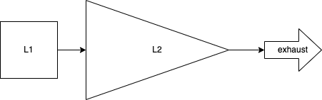

# RFC-0320/TurbineModel

## The DAN peg-in mechanism, or Turbine model

**Maintainer(s)**: [Cayle Sharrock](https://github.com/CjS77)

# Licence

[The 3-Clause BSD Licence](https://opensource.org/licenses/BSD-3-Clause).

Copyright 2022 The Tari Development Community

Redistribution and use in source and binary forms, with or without modification, are permitted provided that the
following conditions are met:

1. Redistributions of this document must retain the above copyright notice, this list of conditions and the following
   disclaimer.
2. Redistributions in binary form must reproduce the above copyright notice, this list of conditions and the following
   disclaimer in the documentation and/or other materials provided with the distribution.
3. Neither the name of the copyright holder nor the names of its contributors may be used to endorse or promote products
   derived from this software without specific prior written permission.

THIS DOCUMENT IS PROVIDED BY THE COPYRIGHT HOLDERS AND CONTRIBUTORS "AS IS", AND ANY EXPRESS OR IMPLIED WARRANTIES,
INCLUDING, BUT NOT LIMITED TO, THE IMPLIED WARRANTIES OF MERCHANTABILITY AND FITNESS FOR A PARTICULAR PURPOSE ARE
DISCLAIMED. IN NO EVENT SHALL THE COPYRIGHT HOLDER OR CONTRIBUTORS BE LIABLE FOR ANY DIRECT, INDIRECT, INCIDENTAL,
SPECIAL, EXEMPLARY OR CONSEQUENTIAL DAMAGES (INCLUDING, BUT NOT LIMITED TO, PROCUREMENT OF SUBSTITUTE GOODS OR
SERVICES; LOSS OF USE, DATA OR PROFITS; OR BUSINESS INTERRUPTION) HOWEVER CAUSED AND ON ANY THEORY OF LIABILITY,
WHETHER IN CONTRACT, STRICT LIABILITY OR TORT (INCLUDING NEGLIGENCE OR OTHERWISE) ARISING IN ANY WAY OUT OF THE USE OF
THIS SOFTWARE, EVEN IF ADVISED OF THE POSSIBILITY OF SUCH DAMAGE.

## Language

The keywords "MUST", "MUST NOT", "REQUIRED", "SHALL", "SHALL NOT", "SHOULD", "SHOULD NOT", "RECOMMENDED",
"NOT RECOMMENDED", "MAY" and "OPTIONAL" in this document are to be interpreted as described in
[BCP 14](https://tools.ietf.org/html/bcp14) (covering RFC2119 and RFC8174) when, and only when, they appear in all capitals, as
shown here.

## Disclaimer

This document and its content are intended for information purposes only and may be subject to change or update
without notice.

This document may include preliminary concepts that may or may not be in the process of being developed by the Tari
community. The release of this document is intended solely for review and discussion by the community of the
technological merits of the potential system outlined herein.

## Goals

The Thaum is a [unit of magic](https://discworld.fandom.com/wiki/Thaum). Thaums are used to power the DAN's economic
engine.

This RFC describes the motivation and mechanism of the Tari to Dan peg-in mechanism. 

## Related Requests for Comment

* [RFC-0111: Base Node Architecture](./RFC-0111_BaseNodeArchitecture.md)
* [RFC-0303: Digital Assets Network](RFC-0303_DanOverview.md)

## Description

Side-chains are related to their parent chains via a pegging mechanism. In general, peg-in transactions (transferring
value to the side-chain) are straightforward. One locks value up on the parent chain, which can be referenced by the
side-chains. However, the reverse transaction is fraught with difficulty, since the parent chain must know almost
nothing about the transaction particulars of the side chain. We know this is the case, otherwise the entire
side-chain + parent-chain system are forced to work in lock-step and the two chains are really just one larger, more 
complicated chain.

Peg outs are particularly difficult if the participants change on the side-chain (as opposed to say, payment 
channels, like the Lightning Network, where the same parties peg-in and -out).

There are several proposals to develop a reliable two-way peg, including [space-chains], [drive-chains] and federated
side-chains, like [elements]. All of them have particular trade-offs and difficulties.

For Tari, we propose a slightly different approach: A one-way peg with persistent 2nd-layer burn.

Because the operating principle is quite similar to that of a gas turbine, we call this approach the _turbine model_.
Fuel (Tari) is fed into the turbine, which is burnt (also burnt :)) which produces a hot, motive gas (Thaums) that 
drives the engine (the DAN). The exhaust gas is ejected from the rear of the turbine (a portion of the instruction 
fees are burnt).

### An aside - the monetary policy trilemma

The [monetary policy trilemma](https://www.investopedia.com/terms/t/trilemma.asp) states that you _cannot
control all 3 of these things simultaneously_:

1. exchange rate
2. monetary policy (i.e. minting and burning to control supply)
3. flow of capital (money leaving or entering the system)

Let's briefly consider the trilemma from the point of view of the DAN.

#### Monetary policy

We are effectively forced to control monetary policy.
Or put another way, we can't let people freely mint their own Thaums. Unfortunately, even though we have "chosen" to
control supply, it's difficult for us to control the Thaums supply in practice. In the physical world, the money 
supply is typically managed by a central bank, with the emphasis on "central".

The designers of a decentralised monetary system have precious few levers available to control supply and no simple ones.

#### Capital flow

Allowing free capital flow would require a reliable and efficient peg-out mechanism from the DAN back to the base layer.
However, I argue that this is an Achilles heel. _Any_ peg-out system you can devise that is coupled with a burn-type 
peg-in mechanism is an existential threat to the base layer.

Why? Because the peg-out necessarily requires creation of coins on the base layer by _trusting_ some mechanism 
external to it. Note that we're not bringing UTXOs that were pegged-in back into circulation (in this 
case they would not be burned, merely locked-up as in a traditional peg). Therefore, the base layer accounting simply 
has to accept these mints as valid. 

Consequently, _any bug whatsoever on the DAN related to the minting process' authenticity_  could lead to undetectable 
inflation on the base layer. 

A central axiom of side-chain design, if there is such a thing, is that the side-chain should pose _zero_ risk to the 
security of the base layer. For this reason, the burn mechanism effectively _excludes the possibility of peg ins_.

So essentially, we cannot allow the free flow of capital either.

#### Exchange rate

Since we have already picked two legs of the trilemma, we cannot do anything about the third, and must allow the change 
rate to float.

### The turbine model

This is actually not as terrible as it sounds. The trilemma doesn't force you to sit at the vertex of the monetary
policy triangle. If you allow _partial_ freedoms in supply and capital flow, then the exchange rate will move, but
will tend to remain range-bound.

Although capital flow here is not free, it's not completely restricted either:
1. Peg-ins are completely unrestricted.
2. Submarine-swaps allow people to remove money from the system on the micro-level (albeit not on the macro level).

And the money supply can be tuned, if not controlled. This all leads to the proposal of a new mechanism, the turbine 
model:

The DAN Thaum supply is increased by user peg-in deposits, and any other mechanism that we may want to enforce, 
such as asset issuer financing. 

To prevent the eventual collapse of the Thaum price to zero, there must be an exhaust mechanism that continually 
removes Thaums from the system..

The simplest exhaust mechanism is to simply burn a fraction of Thaums fees from every transaction! These can be very
low. Presumably, over the long-run the burn rate should approximately match the Tari base layer tail emission.

The exhaust places a permanent upward pressure on the Thaums exchange rate; but it will never exceed 1:1 with Tari,
since any premium will be immediately arbitraged away. This is because anyone can _always_ burn as much Tari as they 
wish and mint Thaums at a 1:1 ratio on the DAN and then sell them for a risk-free profit. This action will increase 
the supply of Thaums and drive the price back down to parity.

If the exhaust is temporarily insufficient to hold the peg, the Thaums price will drop below 1 XTR. This will 
immediately shut off deposits because submarine swaps will a be cheaper route to obtaining Thaums than burning 
Tari (which are always 1:1). Since the exhausts upward price pressure is a constant force, the Thaums price will 
eventually approach 1:1 again.

Over time, we expect this mechanism to provide a somewhat stable peg between Thaum and Tari with the Thaum price 
occasionally dropping below parity and possibly remaining there for some time. As secondary markets for the 
Tari-Thaum pair matures, this event will immediately create a bid on Thaums, since -- in the absence of catastrophic 
failure -- speculators know that the Thaum price will eventually return to parity, causing upward pressure to come into 
play quickly and efficiently.

# Change Log

| Date        | Change      | Author     |
|:------------|:------------|:-----------|
| 1 Nov 2022  | First draft | CjS77      |

[space-chains]: https://www.youtube.com/watch?v=N2ow4Q34Jeg
[drive-chains]: https://www.drivechain.info/
[elements]: https://elementsproject.org/how-it-works