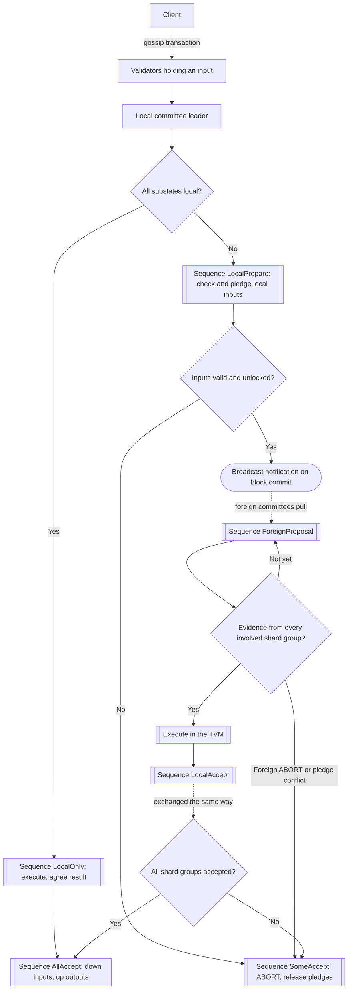

# I-TIP-RFC-O-0330: OotleConsensus

| TIP             | [I-TIP-RFC-O-0330](#i-tip-rfc-o-0330-ootleconsensus)                      |
|-----------------|---------------------------------------------------------------------------|
| Title           | The Ootle HotStuff Consensus Algorithm                                    |
| Last Modified   | 2026-09-07                                                                |
| Authors         | Tari Labs                                                                 |
| Status          | Implemented                                                               |
| Type            | RFC                                                                       |
| Created         | 2023-10-30                                                                |
| References      | [I-TIP-RFC-O-0305](RFC-0305_Consensus.md)                                 |

## The Ootle HotStuff Consensus Algorithm

**Maintainer(s)**: [Cayle Sharrock](https://github.com/CjS77),[stringhandler](https://github.com/stringhandler)

# Licence

[The 3-Clause BSD Licence](https://opensource.org/licenses/BSD-3-Clause).

Copyright 2022 The Tari Development Community

Redistribution and use in source and binary forms, with or without modification, are permitted provided that the
following conditions are met:

1. Redistributions of this document must retain the above copyright notice, this list of conditions and the following
   disclaimer.
2. Redistributions in binary form must reproduce the above copyright notice, this list of conditions and the following
   disclaimer in the documentation and/or other materials provided with the distribution.
3. Neither the name of the copyright holder nor the names of its contributors may be used to endorse or promote products
   derived from this software without specific prior written permission.

THIS DOCUMENT IS PROVIDED BY THE COPYRIGHT HOLDERS AND CONTRIBUTORS "AS IS", AND ANY EXPRESS OR IMPLIED WARRANTIES,
INCLUDING, BUT NOT LIMITED TO, THE IMPLIED WARRANTIES OF MERCHANTABILITY AND FITNESS FOR A PARTICULAR PURPOSE ARE
DISCLAIMED. IN NO EVENT SHALL THE COPYRIGHT HOLDER OR CONTRIBUTORS BE LIABLE FOR ANY DIRECT, INDIRECT, INCIDENTAL,
SPECIAL, EXEMPLARY OR CONSEQUENTIAL DAMAGES (INCLUDING, BUT NOT LIMITED TO, PROCUREMENT OF SUBSTITUTE GOODS OR
SERVICES; LOSS OF USE, DATA OR PROFITS; OR BUSINESS INTERRUPTION) HOWEVER CAUSED AND ON ANY THEORY OF LIABILITY,
WHETHER IN CONTRACT, STRICT LIABILITY OR TORT (INCLUDING NEGLIGENCE OR OTHERWISE) ARISING IN ANY WAY OUT OF THE USE OF
THIS SOFTWARE, EVEN IF ADVISED OF THE POSSIBILITY OF SUCH DAMAGE.

## Language

The keywords "MUST", "MUST NOT", "REQUIRED", "SHALL", "SHALL NOT", "SHOULD", "SHOULD NOT", "RECOMMENDED",
"NOT RECOMMENDED", "MAY" and "OPTIONAL" in this document are to be interpreted as described in
[BCP 14](https://tools.ietf.org/html/bcp14) (covering RFC2119 and RFC8174) when, and only when, they appear in all
capitals, as
shown here.

## Disclaimer

This document and its content are intended for information purposes only and may be subject to change or update
without notice.

This document may include preliminary concepts that may or may not be in the process of being developed by the Tari
community. The release of this document is intended solely for review and discussion by the community of the
technological merits of the potential system outlined herein.

## Goals

This Request for Comment (RFC) describes the consensus algorithm that the Ootle uses to agree on substate
transitions: HotStuff BFT running over a fixed partition of the substate address space, with an explicit cross-shard
protocol for transactions that span more than one partition.

## Related Requests for Comment

* [I-TIP-RFC-O-0303: The Tari Ootle](./RFC-0303_DanOverview.md)
* [I-TIP-RFC-O-0305: The Ootle Consensus Layer](./RFC-0305_Consensus.md)
* [I-TIP-RFC-O-0314: Validator Node Committee Selection](./RFC-0314_VNCSelection.md)
* [I-TIP-RFC-O-0321: Processing Foreign Proposals](./RFC-0321_ProcessingForeignProposals.md)
* [I-TIP-RFC-O-0350: The Tari Virtual Machine](./RFC-0350_TariVM.md)

## Introduction

Work is not divided between validator nodes according to the contracts they manage, as in Tari DANv1, Polkadot or
Avalanche. Instead the substate address space is partitioned, and validator nodes are distributed over the partitions.
A transaction that reads or writes a substate is agreed by the committee covering that substate's partition, and a
transaction spanning several partitions is agreed by those committees jointly.

This means that nodes have to be prepared to execute transactions against any contract in the network. It creates a
data synchronisation burden, but the payoff — a scalable, decentralised contract layer — significantly outweighs the
trade-off.

<strong>Naming.</strong> This RFC was previously titled "The Tari Cerberus-HotStuff Consensus Algorithm", and
earlier drafts described the protocol in the terms of the <a href="https://arxiv.org/abs/2008.04450">Cerberus</a>
paper — variously as Optimistic and as Pessimistic Cerberus. The design started there, and the paper (together with
the <a href="https://arxiv.org/pdf/1708.03778.pdf">Chainspace</a> paper) remains useful background. What was built
diverges enough that the name is no longer used in the code or in these RFCs. The principal differences are noted
inline below.

## Shards, substates and addresses

A **substate** is a unit of state. Every substate has an address, and the address determines which committee is
responsible for it.

A substate address is 36 bytes: a 32-byte **object key** followed by a 4-byte version number. The object key is
itself a 1-byte **entity id** followed by a 31-byte component key.

That leading entity id byte is what selects the shard. With at most 256 preshards, one byte is a sufficient prefix to
bind a substate to a shard, and `SubstateAddress::to_shard` reads the shard directly from the top bits of it.

This is a deliberate departure from the "state is scattered uniformly at random across the address space" model of
the Cerberus paper, and from earlier drafts of this RFC. Substates created by the same entity share an entity id, so
a component and the vaults it owns land in the <em>same</em> shard and are agreed by a <em>single</em> committee.

Uniform scattering maximises parallelism but makes almost every transaction a cross-shard transaction, and
cross-shard agreement is expensive. Co-locating an entity's substates means the common case — a transaction touching
one component and its vaults — is a purely local decision, while transactions that genuinely span entities still work
through the cross-shard path. Sharding is by <em>entity</em>, not by individual substate.

The address space is divided into a fixed number of contiguous preshards (currently 256), which are collected into
shard groups, one per committee. See [I-TIP-RFC-O-0314](./RFC-0314_VNCSelection.md).

Substates are versioned rather than being single-use slots. The lifecycle of a given version is:

* `Up` — this version is the current state at this address.
* `Down` — this version has been superseded. A downed version can never be used as an input again.

A transaction that mutates a substate downs version $n$ and ups version $n+1$. Because the version is part of the
address, each version has its own address, and a transaction's inputs name a specific version.

Earlier drafts described substate slots as strictly single-use, in the Cerberus sense: an address is used once and
then dead forever. Versioning is the same idea expressed differently — a given <em>version</em> of an address is
single-use — but it means an entity's state has a stable identity across its lifetime, and it is why substate ids and
substate addresses are distinct types.

### Substate types

A substate's value is exactly one of:

* **Component** — an instance of a template, holding contract state.
* **Resource** — the global identifier for a token type: fungible, non-fungible or confidential. The `Resource`
  substate does not hold the tokens; `Vault` and `NonFungible` substates do.
* **Vault** — holds resources. Vaults provide deposit and withdrawal into and out of `Bucket`s during execution.
* **NonFungible** — a single non-fungible item, associated with its resource.
* **Template** — a published template: the WASM module and its metadata. Created by the `PublishTemplate`
  instruction.
* **TransactionReceipt** — the recorded result of a transaction.
* **ValidatorFeePool** — the pool a validator's leader fees accrue to, derived from its claim key. Batching fees into
  a pool avoids a dust-sized value transfer per transaction; the validator withdraws with `ClaimValidatorFees`.
* **Utxo** and **ConfidentialOutput** — a base-layer output brought into the Ootle, and a confidential output within
  it.
* **ClaimedOutputTombstone** — the record that a particular base-layer burn has been claimed, which is what makes a
  peg-in claimable exactly once.

Substate ids are derived deterministically from the transaction hash and a per-transaction counter, under
domain-separated hashes, so that the outputs of a transaction are known before it is executed and every node derives
the same ones.

### Locks

A transaction declares the substates it touches and the lock it needs on each:

* `Read` — the substate is used as a reference and is not changed. Read locks do not conflict with each other.
* `Write` — the substate is downed and a new version upped. Write locks conflict with everything.
* `Output` — the address is created by this transaction.

Two transactions requiring conflicting locks on the same substate cannot both commit.

## The transaction lifecycle

Consensus proceeds by committees producing blocks of ordered **commands**. A command moves one transaction from one
stage to the next; a block may contain many. The stages are:

| Stage           | Meaning                                                                                      |
|:----------------|:----------------------------------------------------------------------------------------------|
| `New`           | Received, never proposed                                                                     |
| `LocalOnly`     | Every input and output is in this shard group; no cross-shard agreement is needed              |
| `LocalPrepared` | This shard group has agreed the transaction is preparable and has pledged its local inputs     |
| `LocalAccepted` | Every involved shard group has prepared and pledged; this shard group has agreed the outcome   |
| `AllAccepted`   | Every involved shard group accepted; the transaction commits                                   |
| `SomeAccepted`  | At least one involved shard group aborted; the transaction aborts                              |

The corresponding commands are `LocalOnly`, `LocalPrepare`, `LocalAccept`, `AllAccept` and `SomeAccept`. Three
further commands are not transaction commands: `ForeignProposal`
([I-TIP-RFC-O-0321](./RFC-0321_ProcessingForeignProposals.md)), `EvictNode`
([I-TIP-RFC-O-0305](./RFC-0305_Consensus.md)) and `EndEpoch`
([I-TIP-RFC-O-0325](./RFC-0325_DanTimeManagement.md)).

Commands are ordered deterministically within a block: `EvictNode` first, then `ForeignProposal` ordered by shard
group and block id, then transaction commands ordered by transaction id, then `EndEpoch`. Every replica therefore
processes a block's commands in exactly the same order and derives the same result.

### Single-shard transactions

If every substate a transaction touches falls in the local shard group, no cross-shard exchange is needed. The
transaction is sequenced as a single `LocalOnly` command: the leader executes it while proposing, replicas re-execute
it while validating, and the block's three-chain commits the result. This is the common case, because an entity's
substates are co-located.

### Cross-shard transactions

1. A client submits the transaction to any validator, or to an indexer, which gossips it. Each committee holding an
   input picks it up.
2. Each involved committee independently sequences a `LocalPrepare`: it checks that its local inputs are at the
   declared versions and are not already locked, and pledges them. A committee that finds an input missing, downed or
   conflicting decides `ABORT` immediately.
3. When the `LocalPrepare` block commits, the committee broadcasts a notification; the other involved committees pull
   the block with its commit proof and sequence it as a `ForeignProposal`
   ([I-TIP-RFC-O-0321](./RFC-0321_ProcessingForeignProposals.md)). Processing it merges the foreign pledges and
   decision into the local transaction record.
4. Once a committee has evidence from every involved shard group, it has the foreign input state it needs. It
   executes the transaction in the Tari Virtual Machine and sequences a `LocalAccept` carrying its decision.
5. `LocalAccept` blocks are exchanged the same way. When every involved shard group has accepted, each sequences
   `AllAccept` and the transaction commits: pledged inputs are downed and outputs in the local shard group are upped.
   If any shard group aborted, each sequences `SomeAccept` and the transaction aborts, releasing all pledges.

Two things are worth calling out.

**Execution failure is not abort.** If executing the transaction returns an error — a template panics, or an account
has insufficient funds — that is a *successful* consensus outcome. The committee agrees the transaction failed,
records the failure in a transaction receipt, and charges the fee. `ABORT` is reserved for the case where the
transaction could not be sequenced at all: a missing or conflicting input, or a foreign shard group that aborted.

**Concurrent conflicting transactions both abort.** If two transactions pledge the same input in different shard
groups, there is no way to determine which was "first", so both abort. This is `ForeignPledgeInputConflict`.

Earlier drafts described this exchange as leader-to-leader: each round's leader forwards the transaction and its
pledged state directly to the leaders of the other involved committees, which forward it to their members. What was
built exchanges <em>committed blocks with commit proofs</em>, pulled on demand after a gossiped notification. The
difference matters: a foreign committee's contribution is only accepted once it has been committed by that committee
and can prove it, so a faulty foreign leader cannot inject state that its own committee never agreed to.

## Local consensus: HotStuff

Within a committee, agreement on each block follows HotStuff. A block is committed once a three-chain of quorum
certificates is built on top of it: each subsequent block's quorum certificate justifies its parent, and a block is
locked and then committed as that chain extends. A quorum is $2f+1$ of the committee's vote power.

The leader for a height is `height % committee_size` over the committee ordered by shard key. A pacemaker triggers a
new view if no valid proposal arrives within `pacemaker_block_time` — 10 seconds — plus a delta; replicas then send a
`NewView` carrying their highest quorum certificate to the leader at the next height. Repeated failure to propose
leads to suspension and eventually to an `EvictNode` command. See
[I-TIP-RFC-O-0305](./RFC-0305_Consensus.md).

### Bounding a block's cost

A leader could otherwise propose a block that takes replicas longer to validate than the block time, stalling the
chain. Four budgets bound this:

* `max_block_weight` and `max_commands_in_block` — what a leader will pack. These are local proposing heuristics, not
  validated on receive, so nodes may run different values without fork risk.
* `max_block_validation_weight` and `max_block_validation_execution_points` — what a replica will accept. These *are*
  consensus rules: a replica keeps a running total while executing a block's commands and stops at the first command
  that pushes it over the limit, voting no. Both are set above the proposing budgets so that honest proposals are
  never rejected.

Weight is size- and IO-based; execution points come from WASM metering plus native cryptographic verification. Both
are needed, because a small transaction can be compute-heavy and a large one cheap to execute. Both are
deterministic, so every replica stops at the same command and votes identically.

## Consensus flow

```mermaid
flowchart TD
    C[Client] --> |gossip transaction| M[Validators holding an input]
    M --> L[Local committee leader]
    L --> LO{All substates local?}

    LO --> |Yes| Only[["Sequence LocalOnly: execute, agree result"]]
    Only --> Commit

    LO --> |No| Prep[["Sequence LocalPrepare: check and pledge local inputs"]]
    Prep --> PrepOk{"Inputs valid and unlocked?"}
    PrepOk --> |No| Abort[["Sequence SomeAccept: ABORT, release pledges"]]
    PrepOk --> |Yes| Notify(["Broadcast notification on block commit"])
    Notify -.-> |foreign committees pull| FP[["Sequence ForeignProposal"]]
    FP --> Ev{"Evidence from every involved shard group?"}
    Ev --> |Not yet| FP
    Ev --> |"Foreign ABORT or pledge conflict"| Abort
    Ev --> |Yes| Exec[["Execute in the TVM"]]
    Exec --> Acc[["Sequence LocalAccept"]]
    Acc -.-> |exchanged the same way| AllAcc{"All shard groups accepted?"}
    AllAcc --> |No| Abort
    AllAcc --> |Yes| Commit[["Sequence AllAccept: down inputs, up outputs"]]
```

## State synchronisation

A validator joining a shard group — at first registration, or after a shuffle moves it — must hold that shard group's
substates before it can validate proposals against them.

Because committee assignment for the next epoch is known before the epoch begins
([I-TIP-RFC-O-0325](./RFC-0325_DanTimeManagement.md)), a validator learns its next shard group in advance and syncs
during the remainder of the current epoch. Sync runs over the `rpc_state_sync` protocol against peers already in the
target shard group, transferring blocks and the substate state tree. A node that falls behind during an epoch
recovers through the same path, driven by catch-up sync requests when it detects that its view is behind its
committee's.

The state tree is a Jellyfish Merkle tree per shard, so a syncing node can verify the state it receives against the
state merkle root committed in blocks rather than trusting the peer serving it.

# Change Log

| Date        | Change                                                                                  | Author |
|:------------|:------------------------------------------------------------------------------------------|:-------|
| 07 Sep 2026 | Retitled; realigned with the implementation: entity-id sharding, command stages, budgets | Tari Labs |
| 17 Dec 2023 | Second draft                                                                             | CjS77  |
| 30 Oct 2023 | First draft                                                                              | CjS77  |

[base layer]: Glossary.md#base-layer

[validator node]: Glossary.md#validator-node

[validator node comittee]: Glossary.md#validator-node-committee

[chainspace]: https://arxiv.org/pdf/1708.03778.pdf "Chainspace whitepaper"

[contract template]: RFC-0303_DanOverview.md#templates
