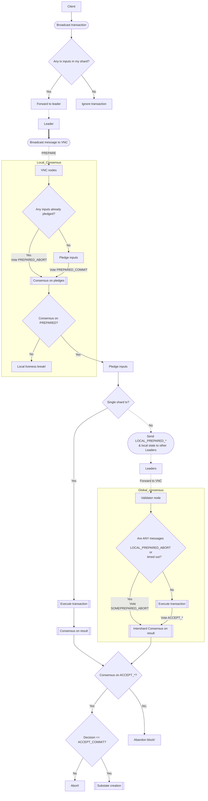

# RFC-0330/Cerberus

## The Tari Cerberus-Hotsuff Consensus Algorithm

**Maintainer(s)**: [Cayle Sharrock](https://github.com/CjS77),[stringhandler](https://github.com/stringhandler)

# Licence

[The 3-Clause BSD Licence](https://opensource.org/licenses/BSD-3-Clause).

Copyright 2022 The Tari Development Community

Redistribution and use in source and binary forms, with or without modification, are permitted provided that the
following conditions are met:

1. Redistributions of this document must retain the above copyright notice, this list of conditions and the following
   disclaimer.
2. Redistributions in binary form must reproduce the above copyright notice, this list of conditions and the following
   disclaimer in the documentation and/or other materials provided with the distribution.
3. Neither the name of the copyright holder nor the names of its contributors may be used to endorse or promote products
   derived from this software without specific prior written permission.

THIS DOCUMENT IS PROVIDED BY THE COPYRIGHT HOLDERS AND CONTRIBUTORS "AS IS", AND ANY EXPRESS OR IMPLIED WARRANTIES,
INCLUDING, BUT NOT LIMITED TO, THE IMPLIED WARRANTIES OF MERCHANTABILITY AND FITNESS FOR A PARTICULAR PURPOSE ARE
DISCLAIMED. IN NO EVENT SHALL THE COPYRIGHT HOLDER OR CONTRIBUTORS BE LIABLE FOR ANY DIRECT, INDIRECT, INCIDENTAL,
SPECIAL, EXEMPLARY OR CONSEQUENTIAL DAMAGES (INCLUDING, BUT NOT LIMITED TO, PROCUREMENT OF SUBSTITUTE GOODS OR
SERVICES; LOSS OF USE, DATA OR PROFITS; OR BUSINESS INTERRUPTION) HOWEVER CAUSED AND ON ANY THEORY OF LIABILITY,
WHETHER IN CONTRACT, STRICT LIABILITY OR TORT (INCLUDING NEGLIGENCE OR OTHERWISE) ARISING IN ANY WAY OUT OF THE USE OF
THIS SOFTWARE, EVEN IF ADVISED OF THE POSSIBILITY OF SUCH DAMAGE.

## Language

The keywords "MUST", "MUST NOT", "REQUIRED", "SHALL", "SHALL NOT", "SHOULD", "SHOULD NOT", "RECOMMENDED",
"NOT RECOMMENDED", "MAY" and "OPTIONAL" in this document are to be interpreted as described in
[BCP 14](https://tools.ietf.org/html/bcp14) (covering RFC2119 and RFC8174) when, and only when, they appear in all
capitals, as
shown here.

## Disclaimer

This document and its content are intended for information purposes only and may be subject to change or update
without notice.

This document may include preliminary concepts that may or may not be in the process of being developed by the Tari
community. The release of this document is intended solely for review and discussion by the community of the
technological merits of the potential system outlined herein.

## Goals

This Request for Comment (RFC) describe the consensus mechanism known as Cerberus as it is implemented in Tari.
Tari implements the Cerberus variant known as Optimistic Cerberus, for the most part, with Hotstuff BFT replacing
pBFT as described in the Cerberus paper.

This RFC serves to document any deviations from the academic paper as well as finer-grained details of the
implementation.

## Related Requests for Comment

* [RFC-303: Digital Assets Network](./RFC-0303_DanOverview.md)

## Introduction

The Tari DAN is based on a sharded BFT consensus mechanism called [Cerberus](https://arxiv.org/abs/2008.04450).

One particular note is that Tari has chosen Hotstuff as the base BFT consensus algorithm over pBFT mentioned in the
paper.

The core idea of Cerberus is that instead of dividing work up between validator nodes according to the contracts
they are managing (as per Tari DANv1, Polkadot, Avalanche, etc.), Cerberus distributes nodes evenly over a set of
state slots, called substates. Any time an instruction modifies the state of a contract, it will affect one or more
substates, and only those nodes that are responsible for covering those addresses will reach consensus on the correct
state changes.

This means that nodes have to be prepared to execute instructions on any contract in the network. This
does create a data synchronisation burden, but the added benefit of a highly scalable, decentralised DAN significantly
outweighs this trade-off.

## Shards, substates and state addresses

The central idea of Cerberus is that all possible state objects are assigned a unique address, deterministically.
Know the state, know the address [^1]. The state space is incredibly large, with 2^256 possible substate addresses;
which is way more than the number of atoms in our galaxy.
The chance of any two pieces of state ever trying to occupy the same substate is vanishingly small.

The state space is also evenly divided into contiguous sections, called shards. Each shard covers a set of
non-overlapping substate addresses and the full set of shards covers the entire state space.

Each validator node registered on the base layer is randomly assigned a shard to cover. The number of shards
depends on the total number of validator nodes in the network.

Collectively, all the nodes covering the same shard are known as a _validator (node) committee_ (VNC).

Broadly speaking, the shard-assignment algorithm will try to arrange things in a way that every shard has the same
number of validator nodes covering it.

The number of nodes in a VNC is set system-wide. The final number has not been determined yet, but it will be a
value, 3n+1, where n is an integer between 8 and 33, giving a committee size of between 25 and 100 nodes.

As nodes continue to join the network, the target committee size stays fixed, whereas the shard size will shrink.
This is what will allow the Tari network to scale to achieve
[thousands of transactions per second](https://www.tari.com/updates/2023-09-11-update-117).

Every substate slot can only be used once. The substate lifecycle is

* `Empty`. No state has ever been stored in this slot.
* `Up`. A transaction output has resulted in some object being stored in this substate slot.
* `Down`. The state in this slot has changed. We mark the substate as 'down' to indicate that the state is no longer
  valid. Once a substate is down, it can never be used again [^2].

[^1]: This is a simplification to convey the general idea. The address derivation procedure is explained in full below.

[^2]: It's possible that substates could be reset, decades in the future, if substate address collisions
become a risk. For now, we treat all down substates as permanently unusable.

## Braided consensus

A question that naturally arises whenever sharded distributed networks are discussed is, what happens when
cross-shard communication happens. With Cerberus, the procedure is that affected shards come together to form a
temporary Hotstuff consensus group, and reach agreement on the correct outcome of the instruction.

A correct outcome is one of:

* `Abort`: The instruction was invalid, and any state changes are rolled back such that the instruction never happened.
* `Commit`: All input substates for the instruction will be set to `Down`, and at least one new substate will be
  marked to `Up` (from `Empty`).

Achieving this outcome entails a fairly complicated dance between the participating nodes[^3]:

* When nodes receive an instruction that affects contract state, the nodes determine the _input substates_ that will
  be consumed in the instruction. This substates MUST currently _all_ be in an `Up` state. If any input state is
  `Empty`, or `Down`, the nodes can immediately vote `Abort` on the instruction.
* Assuming all input states are valid, nodes will then _pledge_ these substates, effectively marking them as pending
  `Down`.
* Then we have cross-shard exchange. Every leader for the round will forward the instruction and the pledged states
  to all other nodes in the wider consensus group.
* Nodes wait until they have received the transaction and pledges from all the other committee leaders. Otherwise
  they time-out, and ???.
* Once this is complete, and all pledges have been received, nodes decide within their local committee whether to
  `Commit` or `Abort`. This procedure proceeds via Hotstuff consensus rules and takes several rounds of
  communication between the local leader and the committee members.

[^3]: For a more formal treatment, refer to Pessimistic-Cerberus in the
[Cerberus paper](https://arxiv.org/abs/2008.04450).

## Cerberus consensus - a diagram

Transaction processing for Pessimistic Cerberus follows the following broad algorithm:

1. A client broadcasts a transaction to multiple validator nodes, ensuring that at least one node from every shard
   that covers the inputs for the transaction receives the transaction. In practice, this can be achieved by
   communicating with a single node, and the node shoulders the responsibility of broadcasting the transaction to
   the rest of the network, including to every node in the node's local VNC.
2. When a transaction is received by a validator node, it checks to see if at least one input for the transaction is
   in the node's shard space. If not, it may ignore the transaction. Otherwise, it forwards the message to the
   current round leader.
3. Soon, every round leader for the shards that contain affected inputs will have received the transaction.
4. The affected shards then begin the _local consensus_ phase. This consists of a full Hotstuff consensus chain with
   the leader proposing a new block containing the transaction, and the committee members voting on the block.
5. At the same time, all local inputs (the subset of transaction inputs covered by the local shard) are marked as
   `Pledged`. If any input is already marked as `Pledged`, the transaction immediately resolves as `Abort`. This step
   prevents double-spending of inputs across concurrent transactions in separate shards. Note that if a double-spend
   is attempted by submitting the two transactions to different shards, then _both_ transactions will be aborted, since
   Cerberus does not have a way to determine which transaction was 'first'.
6. If _every_ input is in a single shard, then the local consensus is sufficient to finalise the outcome of the
   transaction (proceeding to execution phase as described below), and the result can be broadcast to the client.
6. Otherwise, the leader of the round broadcasts the transaction, some metadata, and the local input state to the
   other shards leaders involved in the transaction. Notice that up until this point, _execution_ of the transaction is
   impossible in a multi-shard transaction because no node has all the input state it needs to run the transaction
   instruction. The local consensus phase is solely to determine the validity of the transaction from an input and
   double-spend perspective.
7. When every shard leader has received a message from every other shard leader participating the transaction, and
   none of the messages received was `Abort`, then the shards can begin the _global consensus_ phase.
8. Round leaders transmit the received messages to the rest of their VNC.
9. Each VN checks that the state received from each foreign shard corresponds to the inputs in the transaction. If
   not, the VN can immediately vote `Abort`.
8. At this point, the shard leaders have all the state they need to execute the transaction. Execution is handed off
   to the TariVM which returns a new set of state objects as output. It is important to note that if a transaction
   _execution_ returns an error (because someone tried to spend more than they have, for example), then this _does
   not lead to an `Abort` decision!`
9. Each shard executes the transaction independently, and another Hotstuff consensus chain is produced to achieve
   consensus on the resulting output set. If the transaction is `Abort`, then all pledged inputs are rolled back.
   Otherwise, the decision is `Commit`, and the pledged inputs are marked as `Down`. Any output objects that belong
   in the current shard can be marked as `Up`, and the transaction result is broadcast to the client as well as
   other shards that need to mark new substates as `Up` as a result of the transaction output.

A mermaid flow diagram of the above process is shown below:

The process above describes PCerberus in general, with some modifications from [Chainspace]. There are a few details
that need some additional explanation. In particular, this includes substate address derivation and state
synchronisation.

## Substate address derivation

A substate contains two pieces of information:

* The value of the substate object,
* The version number of the substate object.

The _substate address_ is the universal location of the substate in the 256-bit state space. Most substate addresses
are derived from a hash of their id, the provenance of which depends on the substate value type, and their version.

The substate value depends on the type of data the value represents. It is exactly one of the following:

* Component - A component is an instantiation of a [contract template].
* Resource - A resource represents a token. Tokens can be fungible, non-fungible, or confidential. The `Resource`
  substate does not store the tokens themselves, but serves as the global identifier for the resource. The tokens
  themselves are kept in `Vaults`, or `NonFungible` substates.
* Vault - Resources are stored in Vaults. Vaults provide generalised functionality for depositing and withdrawing
  their resources from the vaults into Buckets.
* NonFungible - A substate representing a singular non-fungible item. Non-fungible items are always associated with
  their associated non-fungible `Resource`.
* NonFungibleIndex - A substate that holds a reference to another substate.
* UnclaimedConfidentialOutput - A substate representing funds that were burnt on the Minotari layer and are yet to
  be claimed in the Tari network.
* TransactionReceipt - A substate recording the result of a transaction.
* FeeClaim - To prevent a proliferation of dust-like value transfers for every transaction due to fees, a fee claim is
  generated instead that allows VNs to aggregate fees and claim them in a single batched transaction at a later time.
  Fee claims remain in the up state forever to prevent double claims.

Substate ids are domain-separated hashes of their identifying data, which depends on substate type as follows:

* Component - Component addresses are derived from the hash of the component's contract template id and a component
  id. The component id is typically a hash of the origin transaction's hash and a counter.
* Resource - Generally a unique, random 256-bit integer, derived from the hash of the transaction hash and a counter.
  Some ids for special resources are hard-coded.
* Vault - Vault ids are a unique, random 256-bit integer, derived from the hash of the transaction hash and a counter.
* NonFungible - The id of a non-fungible item is derived from the item's resource address, and its id. The id
  depends on the specifics of the NFT, and could be an integer, a string, a hash, or a uuid.
* NonFungibleIndex - Non-fungible index ids are derived from the resource they are pointing to and an index offset.
* UnclaimedConfidentialOutput - The UCO id is derived from the burn commitment on the Minotari layer.
* TransactionReceipt - The id of a transaction receipt is the hash of the associated transaction.
* FeeClaim - The id of a fee claim is derived from the epoch number and the validator's public key.

## State synchronisation

# Change Log

| Date        | Change       | Author |
|:------------|:-------------|:-------|
| 12 Dec 2023 | Second draft | CjS77  |
| 30 Oct 2023 | First draft  | CjS77  |

[base layer]: Glossary.md#base-layer

[validator node]: Glossary.md#validator-node

[validator node comittee]: Glossary.md#validator-node-committee
