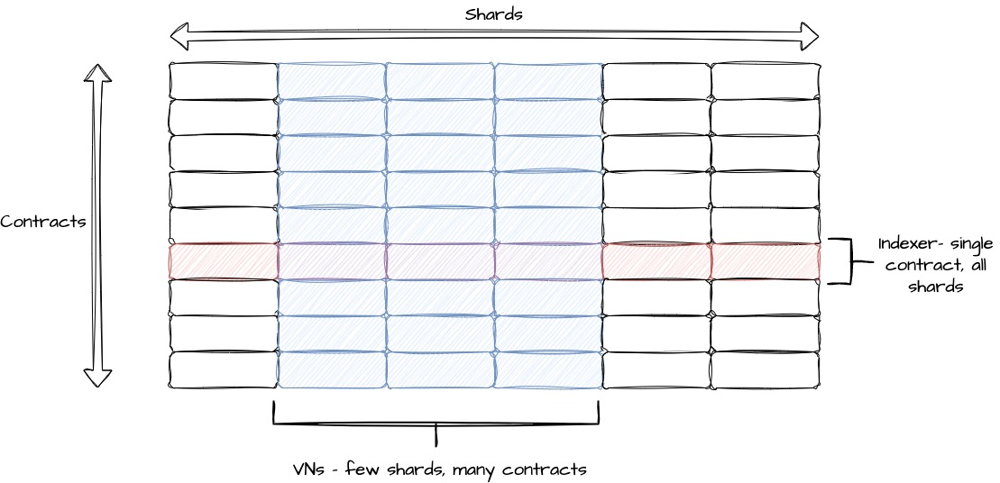

# RFC-0304/Consensus

## The Tari Network Consensus Layer

**Maintainer(s)**: [stringhandler](https://github.com/stringhandler), [Stanley Bondi](https://github.com/sdbondi)

# Licence

[The 3-Clause BSD Licence](https://opensource.org/licenses/BSD-3-Clause).

Copyright 2022 The Tari Development Community

Redistribution and use in source and binary forms, with or without modification, are permitted provided that the
following conditions are met:

1. Redistributions of this document must retain the above copyright notice, this list of conditions and the following
   disclaimer.
2. Redistributions in binary form must reproduce the above copyright notice, this list of conditions and the following
   disclaimer in the documentation and/or other materials provided with the distribution.
3. Neither the name of the copyright holder nor the names of its contributors may be used to endorse or promote products
   derived from this software without specific prior written permission.

THIS DOCUMENT IS PROVIDED BY THE COPYRIGHT HOLDERS AND CONTRIBUTORS "AS IS", AND ANY EXPRESS OR IMPLIED WARRANTIES,
INCLUDING, BUT NOT LIMITED TO, THE IMPLIED WARRANTIES OF MERCHANTABILITY AND FITNESS FOR A PARTICULAR PURPOSE ARE
DISCLAIMED. IN NO EVENT SHALL THE COPYRIGHT HOLDER OR CONTRIBUTORS BE LIABLE FOR ANY DIRECT, INDIRECT, INCIDENTAL,
SPECIAL, EXEMPLARY OR CONSEQUENTIAL DAMAGES (INCLUDING, BUT NOT LIMITED TO, PROCUREMENT OF SUBSTITUTE GOODS OR
SERVICES; LOSS OF USE, DATA OR PROFITS; OR BUSINESS INTERRUPTION) HOWEVER CAUSED AND ON ANY THEORY OF LIABILITY,
WHETHER IN CONTRACT, STRICT LIABILITY OR TORT (INCLUDING NEGLIGENCE OR OTHERWISE) ARISING IN ANY WAY OUT OF THE USE OF
THIS SOFTWARE, EVEN IF ADVISED OF THE POSSIBILITY OF SUCH DAMAGE.

## Language

The keywords "MUST", "MUST NOT", "REQUIRED", "SHALL", "SHALL NOT", "SHOULD", "SHOULD NOT", "RECOMMENDED",
"NOT RECOMMENDED", "MAY" and "OPTIONAL" in this document are to be interpreted as described in
[BCP 14](https://tools.ietf.org/html/bcp14) (covering RFC2119 and RFC8174) when, and only when, they appear in all
capitals, as
shown here.

## Disclaimer

This document and its content are intended for information purposes only and may be subject to change or update
without notice.

This document may include preliminary concepts that may or may not be in the process of being developed by the Tari
community. The release of this document is intended solely for review and discussion by the community of the
technological merits of the potential system outlined herein.

## Goals

This Request for Comment (RFC) describes operation of Tari network Indexers. Indexers are a key actor in providing
rapid, up-to-date and accurate information about the state of Tari contracts to client applications.

## Related Requests for Comment

* [RFC-303: Digital Assets Network](./RFC-0303_DanOverview.md)

## Introduction

Since the Tari network is designed to scale to hundreds of thousands of contracts, and millions of transactions per
hours, having a global state tracking system, like Etherscan, is neither feasible nor advisable. Instead, client
applications (wallets, ticket apps, exchange front-ends etc) will run an _Indexer_ that follows the state of a
finite set of contracts of interest all across the shard-space.

A note on nomenclature: This RFC is primarily focused on the role of <code>indexer_lib</code> in the DAN source 
code. 

The indexer application has additional functionality (such as a copy of the Tari engine for executing dry runs of
transactions) that is outside the domain of what the indexer is responsible for: maintaining a database of contract
state, and delivering that state to client applications.

You can think of Validator nodes as staying in position and managing the state of a fixed set of addresses, possibly
having to operate instructions for thousands of different contracts, while Indexers are constantly hopping around the
shard-space, following the progress of a fixed set of contracts wherever their state goes.

Figure 1 illustrates this dynamic:

The indexer library work via three inter-oparting modules: substate scanning, substate decoding, and the substate 
cache.

### Substate scanning

Given a substate address, the indexer will obtain the state for that substate, if it exists, using the following
algorithm:

1. If the substate is in the cache, retrieve the cached value. Query the network for the next version, and if it
   does not exist, return the cached version.
2. If the cache misses, or the network indicates that the cache is stale because the next version does exist then:
    1. If the next substate version's state is `UP`, update the cache and return the substate.
    2. Otherwise, if the next substate version's state is `DOWN`, query the network until the current version is found.
    3. If the cache misses, and the network indicates that the substate does not exist, then the substate address is
       not valid.
3. After retrieving the latest version from the network, update the cache before returning the substate.

### Substate decoding

The substate decoding module decodes the state at a given substate address, and collects any referenced substate
addresses contained within. This is done recursively until all substates have been decoded.

This is the primary mechanism for discovering the state of a contract, and allowing it to solely track updates to 
the state of contracts the indexer is interested in. This is a key aspect of Tari's scalability. Without this, we 
would fall back into the trap of having a global state machine, which axiomatically, does not scale.

### Substate cache

The substate cache reduces the amount of network traffic by storing the state of substates of interest. When a
request for a substate is made, the cache is checked first. If the substate is not in the cache, the network is
queried for the substate, potentially making many queries to find the latest version of the substate.

If the substate is in the cache, the cache may be checked to see if the substate is stale. Sometimes (e.g. for
transaction dry runs), we may simply be optimistic and accept the cached value as the latest version.

For consensus, the approach is more conservative and the network is consulted to verify the freshness of the cached
value.

The current implementation of the substate cache uses a
[local file-based cache](https://docs.rs/cacache/12.0.0/cacache/) and is highly performant and designed
with concurrency in mind.

# Change Log

| Date        | Change           | Author |
|:------------|:-----------------|:-------|
| 20 Dec 2023 | First draft      | CjS77  |
| 23 Oct 2023 | Placeholder text | CjS77  |

