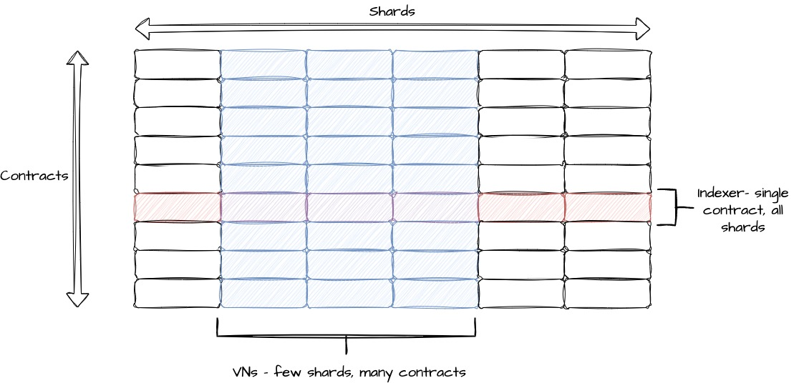

# I-TIP-RFC-O-0331: Indexers

| TIP             | [I-TIP-RFC-O-0331](#i-tip-rfc-o-0331-indexers)                            |
|-----------------|---------------------------------------------------------------------------|
| Title           | Ootle Indexers                                                            |
| Last Modified   | 2026-09-07                                                                |
| Authors         | Tari Labs                                                                 |
| Status          | Implemented                                                               |
| Type            | RFC                                                                       |
| Created         | 2023-10-23                                                                |
| References      |                                                                           |

## Ootle Indexers

**Maintainer(s)**: [stringhandler](https://github.com/stringhandler), [Stanley Bondi](https://github.com/sdbondi)

# Licence

[The 3-Clause BSD Licence](https://opensource.org/licenses/BSD-3-Clause).

Copyright 2022 The Tari Development Community

Redistribution and use in source and binary forms, with or without modification, are permitted provided that the
following conditions are met:

1. Redistributions of this document must retain the above copyright notice, this list of conditions and the following
   disclaimer.
2. Redistributions in binary form must reproduce the above copyright notice, this list of conditions and the following
   disclaimer in the documentation and/or other materials provided with the distribution.
3. Neither the name of the copyright holder nor the names of its contributors may be used to endorse or promote products
   derived from this software without specific prior written permission.

THIS DOCUMENT IS PROVIDED BY THE COPYRIGHT HOLDERS AND CONTRIBUTORS "AS IS", AND ANY EXPRESS OR IMPLIED WARRANTIES,
INCLUDING, BUT NOT LIMITED TO, THE IMPLIED WARRANTIES OF MERCHANTABILITY AND FITNESS FOR A PARTICULAR PURPOSE ARE
DISCLAIMED. IN NO EVENT SHALL THE COPYRIGHT HOLDER OR CONTRIBUTORS BE LIABLE FOR ANY DIRECT, INDIRECT, INCIDENTAL,
SPECIAL, EXEMPLARY OR CONSEQUENTIAL DAMAGES (INCLUDING, BUT NOT LIMITED TO, PROCUREMENT OF SUBSTITUTE GOODS OR
SERVICES; LOSS OF USE, DATA OR PROFITS; OR BUSINESS INTERRUPTION) HOWEVER CAUSED AND ON ANY THEORY OF LIABILITY,
WHETHER IN CONTRACT, STRICT LIABILITY OR TORT (INCLUDING NEGLIGENCE OR OTHERWISE) ARISING IN ANY WAY OUT OF THE USE OF
THIS SOFTWARE, EVEN IF ADVISED OF THE POSSIBILITY OF SUCH DAMAGE.

## Language

The keywords "MUST", "MUST NOT", "REQUIRED", "SHALL", "SHALL NOT", "SHOULD", "SHOULD NOT", "RECOMMENDED",
"NOT RECOMMENDED", "MAY" and "OPTIONAL" in this document are to be interpreted as described in
[BCP 14](https://tools.ietf.org/html/bcp14) (covering RFC2119 and RFC8174) when, and only when, they appear in all
capitals, as
shown here.

## Disclaimer

This document and its content are intended for information purposes only and may be subject to change or update
without notice.

This document may include preliminary concepts that may or may not be in the process of being developed by the Tari
community. The release of this document is intended solely for review and discussion by the community of the
technological merits of the potential system outlined herein.

## Goals

This Request for Comment (RFC) describes the operation of Ootle Indexers. Indexers provide rapid, up-to-date and
accurate information about the state of Ootle components to client applications.

## Related Requests for Comment

* [I-TIP-RFC-O-0303: The Tari Ootle](./RFC-0303_DanOverview.md)
* [I-TIP-RFC-O-0330: The Ootle HotStuff Consensus Algorithm](./RFC-0330_Cerberus.md)
* [I-TIP-RFC-O-0350: The Tari Virtual Machine](./RFC-0350_TariVM.md)

## Introduction

The Ootle is designed to scale to hundreds of thousands of components and millions of transactions per hour. A global
state tracking system, like Etherscan, is neither feasible nor advisable at that scale. Instead, client applications —
wallets, ticketing apps, exchange front-ends — use an _Indexer_ that follows the state of a finite set of components
of interest, wherever in the shard space that state lives.

Where validator nodes stay in position and manage the state of a fixed slice of the address space, possibly serving
transactions for thousands of different components, Indexers hop around the shard space following a fixed set of
components.

Figure 1 illustrates this dynamic:

A note on nomenclature: this RFC is primarily about the <code>indexer_lib</code> crate — maintaining a view of
component state and delivering it to client applications.

The indexer <em>application</em> (<code>tari_indexer</code>) is built on that library and does more: it runs a copy
of the Tari engine for dry runs, gossips transactions to validators, indexes events, exposes JSON-RPC and GraphQL
APIs, and tracks network-wide economic state. Those are outside the domain of what the indexer library is responsible
for.

The indexer library works via three interoperating modules: substate scanning, substate decoding, and the substate
cache.

### Substate scanning

Given a substate address, the indexer obtains the state at that address, if it exists, using the following algorithm:

1. If the substate is in the cache, retrieve the cached value. Query the network for the next version, and if it does
   not exist, return the cached version.
2. If the cache misses, or the network indicates that the cache is stale because a later version exists, then:
    1. if the next version's state is `Up`, update the cache and return the substate;
    2. otherwise, if the next version's state is `Down`, query the network until the current version is found;
    3. if the cache misses and the network indicates that the substate does not exist, then the address is not valid.
3. After retrieving the latest version from the network, update the cache before returning the substate.

Because a substate address embeds its version, "the next version" is a different address, and the indexer resolves it
by querying the committee responsible for that address.

### Substate decoding

The substate decoding module decodes the state at a given address and collects any substate addresses referenced
within it. This is done recursively until all reachable substates have been decoded.

This is the primary mechanism for discovering the state of a component, and for letting an indexer track only the
components it is interested in. This is a key aspect of the Ootle's scalability: without it, we would fall back into
the trap of a global state machine, which axiomatically does not scale.

Note that an entity's substates are co-located in one shard group
([I-TIP-RFC-O-0330](./RFC-0330_Cerberus.md)), so decoding a component and fetching the vaults it owns is usually a
query against a single committee rather than a scatter across the network.

### Substate cache

The substate cache reduces network traffic by storing the state of substates of interest. When a request for a
substate is made, the cache is checked first. If the substate is not in the cache, the network is queried, potentially
making several queries to find the latest version.

If the substate is in the cache, the cache may be checked for staleness. Sometimes — for transaction dry runs, for
instance — we may simply be optimistic and accept the cached value as the latest version.

Where a value is going to be committed to as a transaction input, the approach is more conservative and the network is
consulted to verify the freshness of the cached value. This matters because an indexer commits to a specific input
version when it submits a transaction: if the indexer is stale, the transaction will be aborted for using a downed
input.

`SubstateCache` is a trait, so the storage behind it is pluggable. The indexer application implements it over a
[local file-based cache](https://docs.rs/cacache/13.1.0/cacache/), which is performant and designed with concurrency
in mind.

## Indexers are a trusted party

An indexer is trusted by the clients that use it. It can serve stale state, or lie. Users who need a trustless view
must run their own indexer; the state an indexer serves is verifiable against the state merkle roots committed in
blocks, but only if someone actually checks.

# Change Log

| Date        | Change                                                        | Author |
|:------------|:----------------------------------------------------------------|:-------|
| 07 Sep 2026 | Correct the document title; DAN -> Ootle; note versioning     | Tari Labs |
| 20 Dec 2023 | First draft                                                    | CjS77  |
| 23 Oct 2023 | Placeholder text                                               | CjS77  |
