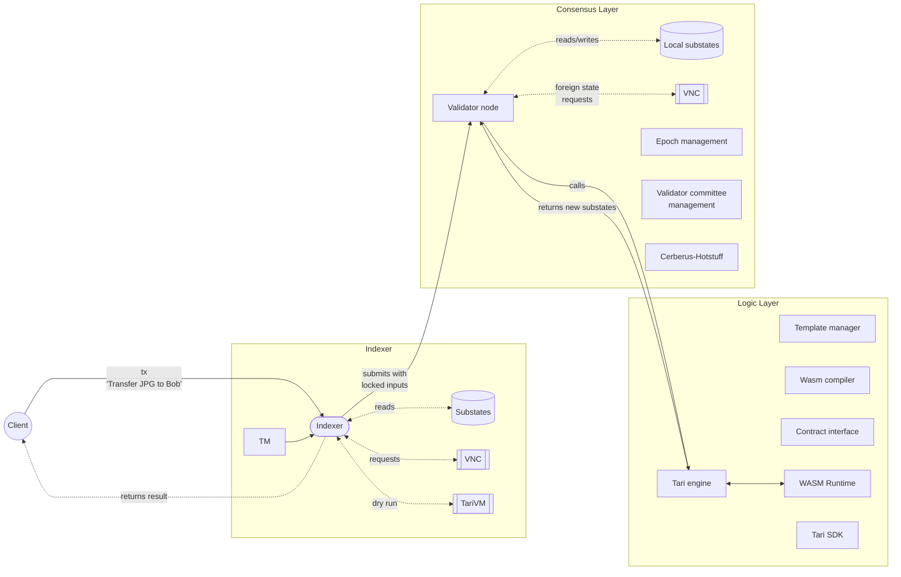

# RFC-0350/TariVM

## The Tari Virtual Machine

**Maintainer(s)**: [Cayle Sharrock](https://github.com/CjS77)

# Licence

[The 3-Clause BSD Licence](https://opensource.org/licenses/BSD-3-Clause).

Copyright 2023 The Tari Development Community

Redistribution and use in source and binary forms, with or without modification, are permitted provided that the
following conditions are met:

1. Redistributions of this document must retain the above copyright notice, this list of conditions and the following
   disclaimer.
2. Redistributions in binary form must reproduce the above copyright notice, this list of conditions and the following
   disclaimer in the documentation and/or other materials provided with the distribution.
3. Neither the name of the copyright holder nor the names of its contributors may be used to endorse or promote products
   derived from this software without specific prior written permission.

THIS DOCUMENT IS PROVIDED BY THE COPYRIGHT HOLDERS AND CONTRIBUTORS "AS IS", AND ANY EXPRESS OR IMPLIED WARRANTIES,
INCLUDING, BUT NOT LIMITED TO, THE IMPLIED WARRANTIES OF MERCHANTABILITY AND FITNESS FOR A PARTICULAR PURPOSE ARE
DISCLAIMED. IN NO EVENT SHALL THE COPYRIGHT HOLDER OR CONTRIBUTORS BE LIABLE FOR ANY DIRECT, INDIRECT, INCIDENTAL,
SPECIAL, EXEMPLARY OR CONSEQUENTIAL DAMAGES (INCLUDING, BUT NOT LIMITED TO, PROCUREMENT OF SUBSTITUTE GOODS OR
SERVICES; LOSS OF USE, DATA OR PROFITS; OR BUSINESS INTERRUPTION) HOWEVER CAUSED AND ON ANY THEORY OF LIABILITY,
WHETHER IN CONTRACT, STRICT LIABILITY OR TORT (INCLUDING NEGLIGENCE OR OTHERWISE) ARISING IN ANY WAY OUT OF THE USE OF
THIS SOFTWARE, EVEN IF ADVISED OF THE POSSIBILITY OF SUCH DAMAGE.

## Language

The keywords "MUST", "MUST NOT", "REQUIRED", "SHALL", "SHALL NOT", "SHOULD", "SHOULD NOT", "RECOMMENDED",
"NOT RECOMMENDED", "MAY" and "OPTIONAL" in this document are to be interpreted as described in
[BCP 14](https://tools.ietf.org/html/bcp14) (covering RFC2119 and RFC8174) when, and only when, they appear in all
capitals, as
shown here.

## Disclaimer

This document and its content are intended for information purposes only and may be subject to change or update
without notice.

This document may include preliminary concepts that may or may not be in the process of being developed by the Tari
community. The release of this document is intended solely for review and discussion by the community of the
technological merits of the potential system outlined herein.

## Goals

This RFC describes the design goals and rationale for the Tari Virtual Machine (TVM).

## Related Requests for Comment

* [RFC-0303: Digital Assets Network](RFC-0303_DanOverview.md)
* [RFC-305: The Tari Network Consensus Layer](RFC-0305_Consensus.md)

## Description

The Consensus Layer for the Tari network, described in [RFC-0305](RFC-0305_Consensus.md), is responsible for
distributed and trust-minimised decision-making in the Tari digital assets network (DAN).

The consensus layer is blind to any notions of smart contracts, NFTs or stablecoins. It merely enforces that
decision made by honest nodes are propagated to the rest of the network.

Business logic is encapsulated in the Tari Logic layer.

The relationship between the logic and the consensus layers is best illustrated by the transaction flow, from client
to resolution. This flow is diagrammed in Figure 1.

The client creates a transaction using a [transaction manifest](#the-transaction-manifest). The manifest collates
every contract, function call and log entry that the client wants to execute into a single bundle. The manifest is then
submitted to an indexer that will collect all the input state required for the transaction pre-emptively. This is a
deviation from the Cerberus and Chainspace papers and allows the indexer to perform a dry-run of the transaction before
submitting it to a validator node.

The advantage of this is that the client can be notified of any errors before submitting the transaction to the
network and incurring fees.

On the other hand, the indexer commits to the given set of inputs when submitting the transaction to the validator node.
If the indexer is mistaken, or lagging in its updates, it is possible that the transaction will be aborted due to
attempting to use expired inputs.

However, this is not expected to happen often, and assuming everything is in order, the validator node will confirm
the correct version of all the input states by collecting all local and foreign substates involved in the transaction.

If these are satisfactory and match what was provided by the indexer, the validator node will pass the transaction
manifest data along with the input state to the Tari Engine for execution.

The Tari Engine will determine which WASM modules are required to perform this work, load them into a WASM runtime,
and execute the functions. The Tari engine makes use of several services to help it in this task, including the
template manager, the Tari SDK, and Tari runtime wrapper.

The execution result (whether successful or not) is returned to the validator node, which then compares the results
with its peers via Hotstuff consensus to achieve agreement on the final result. If consensus is achieved, the affected
substates are updated (see [RFC-330](RFC-0330_Cerberus.md)) and the result is relayed to the indexer who passes it
on to the client.

A key point here is that the consensus layer delegates *all* business logic to the logic layer. However, _only_ the
consensus layer has the ability to make changes to the state of the network, after reaching consensus.

The Tari Logic layer comprises several submodules:

* **The Tari engine**. The Tari engine is responsible for the transaction execution process and fee disbursements.
* **The Template manager**. The template manager polls the Minotari base layer looking for template registration
  transactions.
* **The Tari runtime**. The Tari runtime wraps a [WASM virtual machine](#why-web-assembly) that executes the compiled
  contract code. The runtime is able to calculate the total compute requirements for every instruction, which determines
  the transaction fee.
* **The contract interface (ABI)**. This is a list of functions, their arguments and return values that a particular
  contract is able to execute. The ABI is generated when the contract template is compiled.
* **The transaction manifest**. This is a high-level set of instructions that a client application generates to achieve
  some user goal.

### The Tari engine

The Tari engine is responsible for the transaction execution process and fee disbursements. It communicates with
other actors in the Tari network via JSON-RPC. Transactions can be submitted to be executed via the
`submit_transaction` procedure call.

A transaction contains the following information:

* A list of input substate that will be downed (spent).
* A list of input substates that are used as references, but their state is not altered.
* The list of instructions to execute (call method, claim funds, emit logs etc.).
* Signatures
* Network metadata

Transaction execution proceeds via the following high-level flow:

* The engine determines the total fee for the transaction by charging for every operation executed within the WASM
  runtime, as per the [fee schedule](#the-tari-fee-schedule).
* The engine initializes a WASM runtime, which executes the instructions embedded in the transaction. For each
  instruction, a [template provider] will attempt to provide the WASM, or other compatible binary, to execute the
  instruction with the given input parameters. See also the [base node scanner](#base-node-scanner). For now, only
  WASM modules are supported, but in future, additional runtimes could be supported by the Tari Engine, including
  Zero-Knowledge contracts, or the EVM.
* The result of execution -- the execution status, and the set of outputs -- is passed back to the consensus layer.
  Note that outside of the vanishingly small chance of an output substate collision, even a failed execution attempt is
  a 'positive' (i.e. `COMMIT`ted) result in terms of consensus, as long as the super-majority of nodes agree that
  "failure" is the consensus result!

#### Template manager

The Tari engine maintains a service that scans the Minotari chain every few minutes that among other things, looks
for template registration transactions.

When a new template is registered, the template manager will locate the registered WASM module, validate it, and
store it in the local database.

The template manager abstracts away issues such as template versioning, whether the module is stored in IPFS, or a
centralised repository. It can also request binaries from a peer to reduce the load on external services.

In future, the template manager might also be able to retrieve source code, and make use of reproducible builds to
compile audited source code and add it to the local WASM repository.

### The Tari runtime

The Tari runtime is a wrapper that provides common functionality for executing arbitrary smart contracts in WASM  
modules. Functionality includes:

* calling a function,
* calling a method,
* emitting a log entry,
* pushing an object into the workspace.

In combination with a contract's ABI, the runtime is able to execute almost any contract code.

Tari uses the [wasmer](https://wasmer.io/) runtime to actually load and execute Web Assembly inside a secure,
sandboxed environment.

## The contract interface (ABI)

Rust is strongly-typed, yet we need to be able to call an unlimited variety of functions and methods from arbitrary
contracts in a unified, consistent way. This is where the ABI comes in. It defines all the public methods and
their arguments that a contract exposes.

The ABI is generated when a contract template is compiled from Rust source.

## The transaction manifest

When a client wants to interact with the DAN, it is often the case that she wants to invoke multiple functions
across multiple contracts simultaneously. For example, Alice may want to buy a monkey NFT from Bob. Her transaction
might lock funds in a cryptographic escrow (in the Tari contract) until she has proof that the NFT has landed in her
NFT account (which is in a different contract).

The transaction manifest collects all the information necessary to achieve this goal, including the contract(s)
function(s) to call, their arguments, fee information and all the necessary signature and witness data to authorise the
transaction. The transaction manifest is compiled into an abstract syntax tree (AST) that can be consumed by a
validator node.

Internally, A manifest is simply a list of manifest _intents_ that are bundled together into an atomic whole.

An intent is typically one of the following:

* A template invocation or component invocation, indicating that the user wants to execute a function on a contract,
  supplying the necessary input arguments.
* A log entry, providing the log level and message.

## Why Web Assembly?

The Smart contract execution environment is incredibly hostile. The runtime is effectively tasked to run _arbitrary
code_ on a global system that has potentially billions of dollars of value at stake.

It is therefore critical that the execution environment does not affect state in the broader network that it is
not entitled to, but also, the code cannot be allowed to jailbreak the execution environment of the validator node
itself and wreak havoc on the host system.

Thus, the runtime environment should

* be strictly sandboxed,
* support multiple concurrent VM without being a resource hog,
* have no access to the host system internals, including disk storage, camera, microphones, etc.
* be ephemeral and support rapid cold starts.

Given these onerous requirements, rather than reinvent the wheel, we considered several existing solutions, including

* WebAssembly ([WASM](https://webassembly.org/))
* Extended Berkeley Packet Filter ([eBPF](https://en.wikipedia.org/wiki/EBPF))
* Full virtualisation, such as [KVM](https://www.linux-kvm.org/page/Main_Page) or
  [VmWare](https://www.vmware.com/products/workstation-player.html)

Full virtualisation was quickly discarded as being too heavy-weight. Validator nodes will be required to swap out
contracts constantly, and so cold-starting a runtime environment must be as lightweight and as fast as possible.

Surprisingly, there were very few options remaining, with eBPF and Wasm being the most mature and closest to our
needs. In fact both runtimes are used in smart-contract execution environments today. WASM is used in Stellar, Near,
Cosmos, Polkadot, Radix and a host of others. eBPF is used in Solana.

We chose WASM for the following reasons:

* WASM is a mature, well-supported standard. It is supported by the major browsers, which means that trillion-dollar
  companies like Google, Microsoft and Apple have a vested interest in its success.
* WASM was designed from the ground-up to be a highly performant, lightweight, sandboxed runtime.
* There is fantastic tooling to convert Rust, C, Go, and \[insert favorite language here\] into WASM.
* WASM can run almost anywhere, but especially in the browser. Thus, the path to running Dapps safely in the browser
  is likely much easier.

On the other hand, eBPF was originally design as a packet-filter to protect networks from malicious data packets.
It has since been extended to support a full-blown virtual machine, but it still feels a little like a square peg
being banged into a round hole.

Ultimately, it was a fairly straightforward decision to go forward with WASM.

Independently, [Stellar](https://stellar.org/blog/developers/project-jump-cannon-choosing-wasm) reached the same
conclusion, for much the same reasons.

In contrast, while Polkadot does use WASM, there is an
[active discussion](https://forum.polkadot.network/t/announcing-polkavm-a-new-risc-v-based-vm-for-smart-contracts-and-possibly-more/3811)
to replace Wasm with RISC-V. This VM is being designed explicitly for smart-contract environments and is worth
watching.

For the time-being, WebAssembly is a pretty clear winner.

# Change Log

| Date        | Change           | Author |
|:------------|:-----------------|:-------|
| 20 Dec 2023 | First draft      | CjS77  |

