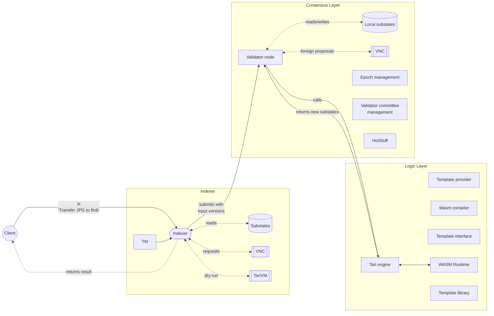

# I-TIP-RFC-O-0350: TariVM

| TIP             | [I-TIP-RFC-O-0350](#i-tip-rfc-o-0350-tarivm)                              |
|-----------------|---------------------------------------------------------------------------|
| Title           | The Tari Virtual Machine                                                  |
| Last Modified   | 2026-09-07                                                                |
| Authors         | Tari Labs                                                                 |
| Status          | Implemented                                                               |
| Type            | RFC                                                                       |
| Created         | 2023-12-20                                                                |
| References      |                                                                           |

## The Tari Virtual Machine

**Maintainer(s)**: [Cayle Sharrock](https://github.com/CjS77)

# Licence

[The 3-Clause BSD Licence](https://opensource.org/licenses/BSD-3-Clause).

Copyright 2023 The Tari Development Community

Redistribution and use in source and binary forms, with or without modification, are permitted provided that the
following conditions are met:

1. Redistributions of this document must retain the above copyright notice, this list of conditions and the following
   disclaimer.
2. Redistributions in binary form must reproduce the above copyright notice, this list of conditions and the following
   disclaimer in the documentation and/or other materials provided with the distribution.
3. Neither the name of the copyright holder nor the names of its contributors may be used to endorse or promote products
   derived from this software without specific prior written permission.

THIS DOCUMENT IS PROVIDED BY THE COPYRIGHT HOLDERS AND CONTRIBUTORS "AS IS", AND ANY EXPRESS OR IMPLIED WARRANTIES,
INCLUDING, BUT NOT LIMITED TO, THE IMPLIED WARRANTIES OF MERCHANTABILITY AND FITNESS FOR A PARTICULAR PURPOSE ARE
DISCLAIMED. IN NO EVENT SHALL THE COPYRIGHT HOLDER OR CONTRIBUTORS BE LIABLE FOR ANY DIRECT, INDIRECT, INCIDENTAL,
SPECIAL, EXEMPLARY OR CONSEQUENTIAL DAMAGES (INCLUDING, BUT NOT LIMITED TO, PROCUREMENT OF SUBSTITUTE GOODS OR
SERVICES; LOSS OF USE, DATA OR PROFITS; OR BUSINESS INTERRUPTION) HOWEVER CAUSED AND ON ANY THEORY OF LIABILITY,
WHETHER IN CONTRACT, STRICT LIABILITY OR TORT (INCLUDING NEGLIGENCE OR OTHERWISE) ARISING IN ANY WAY OUT OF THE USE OF
THIS SOFTWARE, EVEN IF ADVISED OF THE POSSIBILITY OF SUCH DAMAGE.

## Language

The keywords "MUST", "MUST NOT", "REQUIRED", "SHALL", "SHALL NOT", "SHOULD", "SHOULD NOT", "RECOMMENDED",
"NOT RECOMMENDED", "MAY" and "OPTIONAL" in this document are to be interpreted as described in
[BCP 14](https://tools.ietf.org/html/bcp14) (covering RFC2119 and RFC8174) when, and only when, they appear in all
capitals, as
shown here.

## Disclaimer

This document and its content are intended for information purposes only and may be subject to change or update
without notice.

This document may include preliminary concepts that may or may not be in the process of being developed by the Tari
community. The release of this document is intended solely for review and discussion by the community of the
technological merits of the potential system outlined herein.

## Goals

This RFC describes the design goals and rationale for the Tari Virtual Machine (TVM), and the logic layer built
around it.

## Related Requests for Comment

* [I-TIP-RFC-O-0303: The Tari Ootle](./RFC-0303_DanOverview.md)
* [I-TIP-RFC-O-0305: The Ootle Consensus Layer](./RFC-0305_Consensus.md)
* [I-TIP-RFC-O-0330: The Ootle HotStuff Consensus Algorithm](./RFC-0330_Cerberus.md)
* [I-TIP-RFC-O-0331: Ootle Indexers](./RFC-0331_Indexers.md)

## Description

The consensus layer, described in [I-TIP-RFC-O-0305](./RFC-0305_Consensus.md), is responsible for distributed and
trust-minimised decision-making. It is blind to any notion of smart contracts, NFTs or stablecoins; it merely enforces
that decisions made by honest nodes are propagated to the rest of the network.

Business logic is encapsulated in the Tari logic layer.

The relationship between the two layers is best illustrated by the transaction flow, from client to resolution, shown
in Figure 1.

The client builds a transaction, typically from a [transaction manifest](#the-transaction-manifest). The manifest
collates every template invocation, method call and log entry the client wants to execute into a single bundle. It is
usually submitted to an indexer, which collects the input state required for the transaction and can dry-run it before
it is submitted to a validator node. This is a deviation from the Cerberus and Chainspace papers.

The advantage is that the client can be told about errors before submitting to the network and incurring fees.

On the other hand, the indexer commits to a given set of input versions when it submits the transaction. If the
indexer is mistaken, or lagging, the transaction will be aborted for using a downed input.

Assuming everything is in order, the validator committees confirm the input versions, collect the local and foreign
substates involved, and pass the transaction and its input state to the Tari engine for execution.

The engine determines which WASM modules are required, loads them into a WASM runtime, and executes the instructions.
It makes use of several services to do this, including the template provider, the template library and the runtime
wrapper.

The execution result — successful or not — is returned to the validator node, which compares it with its peers'
results through HotStuff consensus. If consensus is achieved, the affected substates are updated (see
[I-TIP-RFC-O-0330](./RFC-0330_Cerberus.md)) and the result is relayed to the indexer, which passes it to the client.

A key point: the consensus layer delegates *all* business logic to the logic layer, but _only_ the consensus layer can
change the state of the network, and only after reaching agreement.

```mermaid
flowchart LR
    Cl((Client)) -------> |tx
    'Transfer JPG to Bob'| Ix1
    Ix1 -.-> |returns result| Cl

    subgraph Indexer
        TM --> Ix1([Indexer])
        Ix1 <-.-> |reads| SS1[(Substates)]
        Ix1 <-.-> |requests| VN1[[VNC]]
        Ix1 <-.-> |dry run| VM1[[TariVM]]
    end
    Ix1 -->|submits with
    input versions| C

    subgraph Logic Layer
      T[Template provider]
      W[Wasm compiler]
      ABI[Template interface]
      E[Tari engine]
      RT[WASM Runtime]
      SDK[Template library]
      E <--> RT
    end

    C --> |calls| E
    E --> |returns new substates| C
    subgraph Consensus Layer
        C[Validator node]
        C <-.-> |reads/writes| SS[(Local substates)]
        C <-.-> |foreign proposals| VNC[[VNC]]
        EM[Epoch management]
        VNCm[Validator committee
         management]
        HS[HotStuff]
    end
```

The logic layer comprises several submodules:

* **The Tari engine.** Responsible for transaction execution and fee accounting.
* **The template provider.** Locates and supplies template code to the engine, from the network or from a local cache.
* **The Tari runtime.** Wraps a [WASM virtual machine](#why-web-assembly) that executes compiled template code. The
  runtime meters compute, which is an input to the transaction fee.
* **The template interface (ABI).** The list of functions and methods a template exposes, with their arguments and
  return values. Generated when the template is compiled.
* **The transaction manifest.** A high-level set of instructions that a client application generates to achieve some
  user goal.

### The Tari engine

The engine executes transactions and accounts for fees. A transaction contains:

* the network it is for,
* a list of *fee instructions*, executed first and charged even if the main instructions fail,
* the list of *instructions* to execute,
* a set of input substate requirements, each naming an address and optionally a version,
* `min_epoch` and a mandatory `max_epoch`, bounding the transaction's lifetime,
* an optional side-channel of prunable blobs, referenced by instructions and committed to by hash,
* a nonce, distinguishing otherwise-identical transactions, and
* signatures.

The mandatory `max_epoch` is worth calling out: it is capped at `max_transaction_validity_epochs` past the current
epoch, so every transaction's death is deterministic. A wallet can declare a transaction permanently dead once that
epoch has passed, and an aborted attempt — which consensus deliberately allows to be re-sequenced — cannot be retried
indefinitely.

The instruction set includes `CallFunction` and `CallMethod`, workspace manipulation (`PutLastInstructionOutputOn`
`Workspace`, `TakeFromBucket`, `PutIntoBucket`, `DropAllProofsInWorkspace`), `Assert`, `CreateAccount`,
`AllocateAddress`, `PublishTemplate`, `UpdateComponentTemplate`, `StealthTransfer`, `PayFeeFromBucket`, `ClaimBurn`
and `ClaimValidatorFees`.

Transaction execution proceeds as follows:

* The engine executes the fee instructions, then the main instructions, charging for each operation as it goes.
* For each instruction, the template provider supplies the WASM to execute it. Only WASM is supported today, but the
  engine's native execution path is priced in the same units, so other runtimes — zero-knowledge templates, or an EVM
  — could be added.
* The result of execution — the status and the set of outputs — is passed back to the consensus layer.

Note that outside the vanishingly small chance of an output address collision, even a failed execution is a
`COMMIT` as far as consensus is concerned, as long as a super-majority of nodes agree that "failure" is the result.

#### Fees

Fees are charged per unit of work actually consumed, not by a flat per-instruction price. The engine attributes every
charge to a `FeeSource`:

| Source                  | What it prices                                                                       |
|:------------------------|:---------------------------------------------------------------------------------------|
| `Initial`               | A flat charge for admitting the transaction                                           |
| `TransactionWeight`     | Size and IO cost, proportional to the transaction's serialised weight                 |
| `RuntimeCall`           | Engine host calls, plus the per-byte cost of log messages                             |
| `Storage`               | Bytes of state written                                                                |
| `SubstateCreate`        | Creating a new substate                                                               |
| `TemplateLoad`          | Loading and instantiating a template                                                  |
| `WasmExecution`         | WASM execution, in proportion to consumed Wasmer metering points                      |
| `NativeExecution`       | Native verification — stealth transfers, confidential withdraws, burn claims — priced in the same points via wall-clock equivalence |
| `SignatureVerification` | Verifying transaction signatures                                                      |
| `TemplatePublish`       | Publishing a template binary. The first `template_size_premium_free_bytes` are priced at the storage rate; every unit beyond is charged quadratically, to discourage oversized templates |
| `ExhaustBurn`           | The exhaust burn ([I-TIP-RFC-O-0320](./RFC-0320_TurbineModel.md)), destroyed rather than paid to the leader |

Metering both WASM and native work in the same units matters for consensus, not just for pricing: block admission is
bounded by total execution points ([I-TIP-RFC-O-0330](./RFC-0330_Cerberus.md)), and that bound would be trivially
evaded by a block full of cheap-to-serialise, expensive-to-verify confidential statements if native work were free.

#### Templates and the template provider

Templates are published to the Ootle with the `PublishTemplate` instruction, which creates a `Template` substate
holding the WASM module. The template address is derived from the publisher and the module, so a published template
is content-addressed and immutable. Publishing a new version yields a new address; an existing component can be moved
to it with `UpdateComponentTemplate`, subject to the component's owner rule.

The template provider is what the engine calls to obtain a template's compiled module. It resolves the template from
the network and caches it, with an on-disk Wasmer module cache so that a hot template does not have to be recompiled
per execution.

Earlier drafts of this RFC described a <em>template manager</em> that scanned the Minotari chain for template
registration transactions and fetched the referenced module from IPFS or a centralised repository.

Base-layer template registration (<code>CodeTemplateRegistration</code>) still exists and is still scanned, but
on-chain publishing has superseded it as the mechanism new templates should use: it removes the dependency on external
hosting, and makes the module part of consensus state rather than something each node fetches and hopes matches.

### The Tari runtime

The Tari runtime wraps the WASM VM and provides the common functionality templates need:

* calling a function or method,
* emitting a log entry,
* pushing an object onto the workspace,
* creating and consuming buckets and proofs, and
* reading and writing component state.

Combined with a template's ABI, the runtime can execute almost any template.

The Ootle uses the [wasmer](https://wasmer.io/) runtime with the Cranelift compiler, together with
`wasmer-middlewares` for metering. Metering is what makes execution cost deterministic and identical on every node,
which is a consensus requirement, not merely a billing convenience.

## The template interface (ABI)

Rust is strongly typed, yet we need to call an unlimited variety of functions and methods from arbitrary templates in
a unified, consistent way. This is where the ABI comes in: it defines all the public functions and methods a template
exposes, and their arguments.

The ABI is generated when a template is compiled from Rust source, by the `#[template]` procedural macro.

## The transaction manifest

When a client wants to interact with the Ootle, it is often the case that it wants to invoke multiple functions
across multiple components at once. For example, Alice may want to buy a monkey NFT from Bob: her transaction locks
funds until she has proof that the NFT has landed in her account.

The transaction manifest collects everything necessary to achieve this: the functions to call, their arguments, fee
instructions, and the signature and witness data authorising the transaction. It is a small DSL, parsed by
`tari_transaction_manifest::parse_manifest` into a list of instructions that a validator node can execute.

Internally, a manifest is a list of instructions bundled into an atomic whole. An instruction is typically:

* a template or component invocation, supplying the necessary input arguments,
* a workspace operation moving values between instructions, or
* an assertion or log entry.

## Why Web Assembly?

The Smart contract execution environment is incredibly hostile. The runtime is effectively tasked to run _arbitrary
code_ on a global system that has potentially billions of dollars of value at stake.

It is therefore critical that the execution environment does not affect state in the broader network that it is
not entitled to, but also, the code cannot be allowed to jailbreak the execution environment of the validator node
itself and wreak havoc on the host system.

Thus, the runtime environment should

* be strictly sandboxed,
* support multiple concurrent VM without being a resource hog,
* have no access to the host system internals, including disk storage, camera, microphones, etc.
* be ephemeral and support rapid cold starts.

Given these onerous requirements, rather than reinvent the wheel, we considered several existing solutions, including

* WebAssembly ([WASM](https://webassembly.org/))
* Extended Berkeley Packet Filter ([eBPF](https://en.wikipedia.org/wiki/EBPF))
* Full virtualisation, such as [KVM](https://www.linux-kvm.org/page/Main_Page) or
  [VmWare](https://www.vmware.com/products/workstation-player.html)

Full virtualisation was quickly discarded as being too heavy-weight. Validator nodes will be required to swap out
contracts constantly, and so cold-starting a runtime environment must be as lightweight and as fast as possible.

Surprisingly, there were very few options remaining, with eBPF and Wasm being the most mature and closest to our
needs. In fact both runtimes are used in smart-contract execution environments today. WASM is used in Stellar, Near,
Cosmos, Polkadot, Radix and a host of others. eBPF is used in Solana.

We chose WASM for the following reasons:

* WASM is a mature, well-supported standard. It is supported by the major browsers, which means that trillion-dollar
  companies like Google, Microsoft and Apple have a vested interest in its success.
* WASM was designed from the ground-up to be a highly performant, lightweight, sandboxed runtime.
* There is fantastic tooling to convert Rust, C, Go, and \[insert favorite language here\] into WASM.
* WASM can run almost anywhere, but especially in the browser. Thus, the path to running Dapps safely in the browser
  is likely much easier.

On the other hand, eBPF was originally design as a packet-filter to protect networks from malicious data packets.
It has since been extended to support a full-blown virtual machine, but it still feels a little like a square peg
being banged into a round hole.

Ultimately, it was a fairly straightforward decision to go forward with WASM.

Independently, [Stellar](https://stellar.org/blog/developers/project-jump-cannon-choosing-wasm) reached the same
conclusion, for much the same reasons.

In contrast, while Polkadot does use WASM, there is an
[active discussion](https://forum.polkadot.network/t/announcing-polkavm-a-new-risc-v-based-vm-for-smart-contracts-and-possibly-more/3811)
to replace Wasm with RISC-V. This VM is being designed explicitly for smart-contract environments and is worth
watching.

For the time-being, WebAssembly is a pretty clear winner.

# Change Log

| Date        | Change                                                                     | Author |
|:------------|:-----------------------------------------------------------------------------|:-------|
| 07 Sep 2026 | On-chain template publishing, fee sources, transaction structure; DAN -> Ootle | Tari Labs |
| 20 Dec 2023 | First draft                                                                  | CjS77  |
