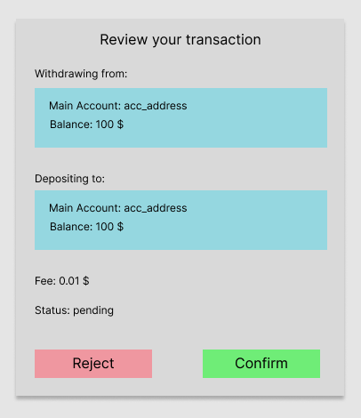

# RFC-1104/ConfirmingTx

## Tari Universe: User confirmation when submitting transactions


**Maintainer(s)**: [karczuRF](https://github.com/karczuRF)

# Licence

[ The 3-Clause BSD Licence](https://opensource.org/licenses/BSD-3-Clause).

Copyright 2024 The Tari Development Community

Redistribution and use in source and binary forms, with or without modification, are permitted provided that the
following conditions are met:

1. Redistributions of this document must retain the above copyright notice, this list of conditions and the following
   disclaimer.
2. Redistributions in binary form must reproduce the above copyright notice, this list of conditions and the following
   disclaimer in the documentation and/or other materials provided with the distribution.
3. Neither the name of the copyright holder nor the names of its contributors may be used to endorse or promote products
   derived from this software without specific prior written permission.

THIS DOCUMENT IS PROVIDED BY THE COPYRIGHT HOLDERS AND CONTRIBUTORS "AS IS", AND ANY EXPRESS OR IMPLIED WARRANTIES,
INCLUDING, BUT NOT LIMITED TO, THE IMPLIED WARRANTIES OF MERCHANTABILITY AND FITNESS FOR A PARTICULAR PURPOSE ARE
DISCLAIMED. IN NO EVENT SHALL THE COPYRIGHT HOLDER OR CONTRIBUTORS BE LIABLE FOR ANY DIRECT, INDIRECT, INCIDENTAL,
SPECIAL, EXEMPLARY OR CONSEQUENTIAL DAMAGES (INCLUDING, BUT NOT LIMITED TO, PROCUREMENT OF SUBSTITUTE GOODS OR
SERVICES; LOSS OF USE, DATA OR PROFITS; OR BUSINESS INTERRUPTION) HOWEVER CAUSED AND ON ANY THEORY OF LIABILITY,
WHETHER IN CONTRACT, STRICT LIABILITY OR TORT (INCLUDING NEGLIGENCE OR OTHERWISE) ARISING IN ANY WAY OUT OF THE USE OF
THIS SOFTWARE, EVEN IF ADVISED OF THE POSSIBILITY OF SUCH DAMAGE.

## Language

The keywords "MUST", "MUST NOT", "REQUIRED", "SHALL", "SHALL NOT", "SHOULD", "SHOULD NOT", "RECOMMENDED",
"NOT RECOMMENDED", "MAY" and "OPTIONAL" in this document are to be interpreted as described in
[BCP 14](https://tools.ietf.org/html/bcp14) (covering RFC2119 and RFC8174) when, and only when, they appear in all capitals, as
shown here.

## Disclaimer

This document and its content are intended for information purposes only and may be subject to change or update
without notice.

This document may include preliminary concepts that may or may not be in the process of being developed by the Tari
community. The release of this document is intended solely for review and discussion by the community regarding the
technological merits of the potential system outlined herein.

## Goals

The aim of this Request for Comment (RFC) is to describe the rules for user confirmation when submitting transactions.

## Related Requests for Comment

- [RFC-1100: Tari Universe Overview](https://github.com/tari-project/rfcs/pull/134)
- [RFC-1101: Tapplet](https://github.com/tari-project/rfcs/pull/137)
- [RFC-0150: Base Layer Wallet Module](RFC-0150_Wallets.md)
- [RFC-0153: Staged Wallet Security](RFC-0153_StagedWalletSecurity.md)

## Description

#### Background

Due to approvals in Ethereum contracts, there are a number of attacks where the user is tricked into signing a transaction granting access to the malicious user to act on their behalf. For example an attacker could create a phishing site and then trick the user to sign approval for an ERC20 to the attacker's public key.

In Tari approvals and transactions happen differently, but there is still some things which can be done to prevent the user from falling victim to these attacks.

#### Concepts of confirming transactions

For the moment the vast majority of dapps uses external wallets, like MetaMask, to allow users to interact with the dapp, confirm and sign transactions. The flow roughly looks like this:

- Init transaction with the data to be signed (e.g. by pressing a button)
- Metamask sign-in request window appears
- User press “sign” button to proceed a transaction
- If a transaction is done (succeeded or failed) another notification appears to inform an user about the tx result.

At Tari Universe simplicity and security should go hand in hand, so below a few concepts of confirming transactions are presented to find the best one.

1. “Metamask-like” flow

   It is just a copy-paste solution widely used in web3. Tari Univers needs something more user-friendly and integrated with the application.

2. No modal window for signing transactions at all

   This concept is rejected due to lack of security.

3. “Mixed model”

   This concept assumes that some tx can be done without explicit user confirmation. In this scenario _x_ (as USD value of transaction) should be defined:

   - no-prompt if the tx value is less than _x_
   - modal window if the tx value is greater than _x_

   Rejected due to lack of clarity about what price level would be the limit and non-intuitiveness

4. Build-in signing window which is part of Tari Univers/tapplet design

   Transaction with presented data can be confirmed by clicking a button on a tapplet window, which appears or on top of a tapplet or is placed aside.

5. Desirable from the point of view of readability and UX.

   Simulate the transaction and summarize the difference of user holdings in case the transaction is executed. It can be done with transaction dry-run before submitting it to a validator node. For more details see [RFC-0350/TariVM](https://rfc.tari.com/RFC-0350_TariVM)

#### Warning in the confirmation dialog

An additional layer of security could be to add a warning to the confirmation dialog if there is something suspicious about the transaction the user is signing. This should be a clear warning that cannot be missed by the user, so the warning shouldn't be shown too often. Another idea is to disable the approval button for a number of seconds (like a countdown) to make sure the user can taken the time to see the warning.

#### Suggested solution

As it was discussed, the security comes first, so definitely all transactions need to be confirmed **by the user** before sending to the Tari Network. At the same time users shouldn’t be overwhelmed by the amount of information, especially not given just the “list of hashes” to sign, which are definitely not understandable for typical users. Therefore the idea is to show the transaction summary and quite a nice example of that is presented by [Radix Wallet](https://www.radixdlt.com/wallet).

Transactions should be shown in a clear, simple and user-friendly way. They should give users complete visibility and control before signing, with a summary of a transaction and meaningful instructions of each step. It should be easy to see what inputs and outputs are, what’s the transaction cost and so on.

Confirming transaction steps should be an inseparable part of the transaction flow, thus its summary should be presented not as a modal window (like MetaMask), but rather within the Tari Universe (on top of a tapplet or to a side of it) - designs need to be discussed and created accordingly.

### Sample transaction in Tari Network

Tari Network [accounts transfer](https://github.com/tari-project/tari-dan/blob/86dd4f910e040cb98b118abaf66a5719b59c987f/applications/tari_dan_wallet_web_ui/src/api/hooks/useAccounts.tsx#L89) is the simplest transaction that can be used to analyze and extract transaction data. This is needed to know what data is available and should be shown to the user when interacting with the tapplet.
At the time of writing this RFC, a transfer transaction has the following parameters:

```
export interface ConfidentialTransferRequest {
  account: ComponentAddressOrName;
  amount: Amount;
  input_selection: ConfidentialTransferInputSelection;
  resource_address: ResourceAddress;
  destination_public_key: string;
  max_fee: Amount;
  output_to_revealed: boolean;
  proof_from_badge_resource: string;
  dry_run: boolean;
}
```

And transaction response.

```
export interface ConfidentialTransferResponse {
  transaction_id: string;
  fee: Amount;
  result: {
      transaction_hash: Uint8Array;
      events: Array<Event>;
      logs: Array<LogEntry>;
      execution_results: Array<InstructionResult>;
      result: TransactionResult;
      fee_receipt: FeeReceipt;
  }
}
```

The last parameter from the `ConfidentialTransferRequest` - `dry_run` - is used for gas calculation and at the same time is crucial for transaction simulation. Therefore it can be used to show transaction result before confirming it. From this the key values can be extracted and shown to the user in a simple and transparent way:

```
withdrawing from: <sender_account_name_or_hash>
depositing to: <destination_account_name_or_hash>
amount: <amount_parsed_to_decimal>
fee: <fee_amount_parsed_to_decimal>
status: <success/failed/pending/etc>
```

#### UX/UI

The entire concept requires the creation of a well-thought-out and clear design. Particular attention should be paid to the issue of warnings, so that only really important threats are shown (kowever implementation can be left to a later date).

The simplest example may look like below.



# Change Log

| Date        | Change                                 | Author |
| :---------- | :------------------------------------- | :----- |
| 23 Apr 2024 | 2nd draft: add a paragrapf on warnings | karczu |
| 25 Mar 2024 | First draft                            | karczu |
