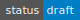
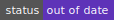

# The Tari RFCs

Tari is a community-driven project. The documents presented in this RFC collection have typically gone through several
iterations before reaching this point:

* Ideas and questions are posted in the [Tari Discord](https://discord.gg/hPABK5WV). This is typically short-form
  content with rapid feedback. Often, these conversations will lead to someone posting an [issue] or RFC [pull request].
* RFCs are "Requests for Comment", so although the proposals in these documents are usually well-thought out, they are
  not set in stone. RFCs can, and should, undergo further evaluation and discussion by the community. RFC comments are
  best made using GitHub [issue]s.
* These RFCs are for new proposals and ideas. Ideas can be discussed and commented on.
* Some issues might be converted into RFCs or vice versa.

## Issues vs RFCs
Most minor bug fixes or feature requests might not require an RFC, and an issue on the relevant repository will be enough. When a new feature or request changes critical consensus or changes how the network operates, it will require an RFC. Sometimes this will be only after an issue existed and a pull request is opened, but typically an RFC would be opened up first.

## RFC Naming
New RFCs should follow the format given in the [RFC template](RFC_template.md).

RFCs are given a numbering scheme `RFC-{X}-{Y}` where `{Y}` is a number and `{X}` is one of the following:
* `MT` - MinoTari, all RFCs for the base layer
* `O` - Ootle, all RFCs for the second layer
* `TU` - Tari Universe, all RFCs relating specifically to Tari Universe

### Prefixes

All stable and in-use RFCs will just be named `RFC-{X}-{Y}`; proposals, accepted, deprecated, and rejected RFCs will use prefixes:

* `p-RFC-{X}-XXXX` is a proposal RFC. It does not have a number yet; `{X}` still needs to be one of the correct tags.
* `a-RFC-{X}-{Y}` is an accepted RFC. It is an accepted idea, but not yet implemented.
* `d-RFC-{X}-{Y}` is a deprecated RFC.
* `r-RFC-{X}-{Y}` is a rejected RFC; these are assigned a number.

## Lifecycle

RFCs go through the following lifecycle, which roughly corresponds to the [COSS](https://github.com/unprotocols/rfc/blob/master/2/README.md):

| Status      |                                                   | Description                                                                                                                                                                                                         |
|:------------|:--------------------------------------------------|:--------------------------------------------------------------------------------------------------------------------------------------------------------------------------------------------------------------------|
| Draft       |            | New ideas and proposals. These are not yet accepted; changes, additions, and revisions can be expected.                                                                                                              |
| Stable      |          | Typographical and cosmetic changes aside, no further changes should be made. Changes to the Tari codebase will lead to the RFC becoming out of date, deprecated, or retired.                                   |
| Out of date |  | This RFC has become stale due to changes in the codebase. Contributions will be accepted to make it stable again if the changes are relatively minor; otherwise it should eventually become deprecated or retired. |
| Deprecated  |  | This RFC has been replaced by a newer RFC document, but is still in use in some places and/or versions of Tari.                                                                                                     |
| Retired     |        | This RFC is no longer in use by the Tari network.                                                                                                                                                                   |

[pull request]: https://github.com/tari-project/tari/pulls?q=is%3Aopen+is%3Apr+label%3ARFC 'Tari RFC pull requests'
[issue]: https://github.com/tari-project/tari/issues?q=is%3Aissue+label%3ARFC 'Tari RFC Issues'